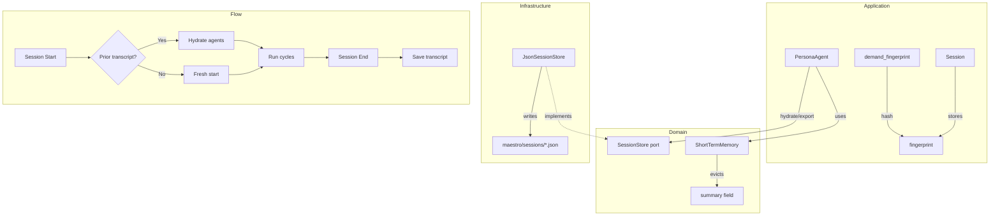

# Implementation Plan: Domain 2.8 — Agent Memory

## Goal

Give Maestro agents **memory that survives** beyond the immediate conversation window
and across sessions — closing the #1 competitive disadvantage identified in
[FEATURE_MAP.md](file:///home/bro/projects/maestro-harness/docs/Product_Engineering/FEATURE_MAP.md)
item 2.8.

### Current State

The only memory primitive is
[ShortTermMemory](file:///home/bro/projects/maestro-harness/src/domain/models/memory.rs) —
a bounded `Vec<Message>` sliding window (capacity 32) inside each `PersonaAgent`.
When the window fills, the **oldest message is silently dropped** (`remove(0)`).
There is no summarization, no persistence, and no cross-session context.

**How it's used today** ([persona_agent.rs](file:///home/bro/projects/maestro-harness/src/application/persona_agent.rs#L76-L81)):

```rust
fn observe(&mut self, input: &[Message]) {
    self.inbox.extend_from_slice(input);
    for msg in input {
        self.memory.record(msg.clone());   // sliding window
    }
}
```

Then in `act()`, memory messages from **prior cycles** are injected before the current inbox,
giving agents a rudimentary recall of earlier context — but only within the current session
and only for the last 32 messages.

**What's missing (from the FEATURE_MAP):**
- Summarization when messages are evicted
- Cross-session persistence (transcript store)
- Memory hydration on session start
- Vector store / RAG (deferred)

### What This Plan Delivers (MLP Scope)

| # | Feature | Description |
|---|---------|-------------|
| 1 | **Summarization-on-eviction** | When messages overflow the window, the oldest batch is compressed into a summary `Message` rather than silently dropped |
| 2 | **Session transcript persistence** | A `SessionStore` port + JSON-file adapter writes the full agent transcript to `maestro/sessions/<fingerprint>.json` |
| 3 | **Cross-session memory hydration** | On session start, a matching prior transcript is loaded and seeds each agent's `ShortTermMemory` |

### What Is Explicitly Deferred

> [!IMPORTANT]
> - **Vector store / embeddings** — requires an embedding provider, similarity search, chunking policy
> - **RAG integration** — requires corpus ingestion pipeline
> - **Cross-project knowledge transfer** — requires a global knowledge base
> - **Automatic summarization via LLM** — the MLP summarizer uses a simple heuristic (content truncation + concatenation); LLM-driven summarization requires async I/O in the domain model

---

## User Review Required

> [!IMPORTANT]
> **New file on disk.** Session transcripts will be persisted to
> `maestro/sessions/<fingerprint>.json` inside the project root. This is consistent
> with the existing `maestro/releases/` convention. The fingerprint is a SHA-256
> hash of the demand string, so identical demands load prior context.

> [!WARNING]
> **Memory injection changes prompt composition.** Agents will now receive a
> `[Session Memory]` system message containing the summarized prior context before
> the current cycle input. This changes the LLM prompt structure. The injected
> content is capped to avoid token explosion.

---

## Proposed Changes

### 1. Domain — Enhanced `ShortTermMemory` with summarization

#### [MODIFY] [memory.rs](file:///home/bro/projects/maestro-harness/src/domain/models/memory.rs)

Add a `summary` field that accumulates evicted content, and a method to retrieve it:

```rust
/// A bounded sliding window of messages with summarization of evicted content.
#[derive(Debug, Clone)]
pub struct ShortTermMemory {
    messages: Vec<Message>,
    capacity: usize,
    /// Accumulated summary of messages evicted from the sliding window.
    summary: Option<String>,
}
```

**Key changes:**

```rust
impl ShortTermMemory {
    pub fn new(capacity: usize) -> Self {
        Self {
            messages: Vec::with_capacity(capacity.min(128)),
            capacity: capacity.max(1),
            summary: None,
        }
    }

    /// Record a message. If at capacity, evict the oldest and summarize it.
    pub fn record(&mut self, message: Message) {
        if self.messages.len() == self.capacity {
            let evicted = self.messages.remove(0);
            self.summarize_evicted(&evicted);
        }
        self.messages.push(message);
    }

    /// Accumulated summary of evicted messages, if any.
    pub fn summary(&self) -> Option<&str> {
        self.summary.as_deref()
    }

    /// Seed memory from a prior session transcript.
    pub fn hydrate(&mut self, prior: &[Message]) {
        for msg in prior {
            self.record(msg.clone());
        }
    }

    /// Export all current messages for persistence.
    pub fn export(&self) -> Vec<Message> {
        self.messages.clone()
    }

    /// Clear all memory and summary.
    pub fn clear(&mut self) {
        self.messages.clear();
        self.summary = None;
    }

    fn summarize_evicted(&mut self, evicted: &Message) {
        let prefix = match evicted.author {
            Some(ref id) => format!("[{}] ", id),
            None => String::new(),
        };
        // Truncate long messages to keep summary bounded
        let content = if evicted.content.len() > 120 {
            format!("{}{}…", prefix, &evicted.content[..120])
        } else {
            format!("{}{}", prefix, evicted.content)
        };
        match self.summary.as_mut() {
            Some(s) => {
                s.push_str(" | ");
                s.push_str(&content);
                // Cap total summary length
                if s.len() > 2048 {
                    let truncated = s[s.len()-1800..].to_string();
                    *s = format!("…{}", truncated);
                }
            }
            None => {
                self.summary = Some(content);
            }
        }
    }
}
```

---

### 2. Domain — `SessionStore` port

#### [NEW] [session_store.rs](file:///home/bro/projects/maestro-harness/src/domain/ports/session_store.rs)

A hexagonal port for session transcript persistence:

```rust
//! `SessionStore` — port for persisting and loading agent session transcripts.

use crate::domain::models::Message;
use thiserror::Error;

/// A persisted session transcript.
#[derive(Debug, Clone)]
pub struct SessionTranscript {
    /// Demand fingerprint (SHA-256 hex of the original demand).
    pub fingerprint: String,
    /// The original demand string.
    pub demand: String,
    /// Agent transcripts keyed by persona id.
    pub transcripts: Vec<AgentTranscript>,
}

/// Transcript for a single agent.
#[derive(Debug, Clone, serde::Serialize, serde::Deserialize)]
pub struct AgentTranscript {
    /// Persona id.
    pub agent_id: String,
    /// Messages from the agent's memory at session end.
    pub messages: Vec<Message>,
    /// Eviction summary, if any.
    pub summary: Option<String>,
}

/// Errors from session store operations.
#[derive(Debug, Error)]
pub enum SessionStoreError {
    #[error("I/O error: {0}")]
    Io(#[from] std::io::Error),
    #[error("serialization error: {0}")]
    Serde(String),
}

/// Port for session transcript storage.
pub trait SessionStore: Send + Sync {
    /// Save a session transcript.
    fn save(&self, transcript: &SessionTranscript) -> Result<(), SessionStoreError>;
    /// Load a prior session transcript by demand fingerprint.
    fn load(&self, fingerprint: &str) -> Result<Option<SessionTranscript>, SessionStoreError>;
}
```

#### [MODIFY] [ports/mod.rs](file:///home/bro/projects/maestro-harness/src/domain/ports/mod.rs)

Add the new module and re-export:

```diff
 pub mod llm_provider;
 pub mod role;
+pub mod session_store;

 pub use llm_provider::{ ... };
 pub use role::Role;
+pub use session_store::{SessionStore, SessionTranscript, AgentTranscript, SessionStoreError};
```

---

### 3. Infrastructure — JSON file adapter

#### [NEW] [session_file_store.rs](file:///home/bro/projects/maestro-harness/src/infrastructure/session_file_store.rs)

```rust
//! JSON file adapter for `SessionStore` (infrastructure layer).

use std::path::{Path, PathBuf};
use crate::domain::ports::session_store::*;

/// Persists session transcripts to `maestro/sessions/<fingerprint>.json`.
pub struct JsonSessionStore {
    sessions_dir: PathBuf,
}

impl JsonSessionStore {
    pub fn new(project_root: &Path) -> Self {
        Self {
            sessions_dir: project_root.join("maestro").join("sessions"),
        }
    }
}

impl SessionStore for JsonSessionStore {
    fn save(&self, transcript: &SessionTranscript) -> Result<(), SessionStoreError> {
        std::fs::create_dir_all(&self.sessions_dir)
            .map_err(SessionStoreError::Io)?;
        let path = self.sessions_dir.join(format!("{}.json", transcript.fingerprint));
        let json = serde_json::to_string_pretty(&transcript.transcripts)
            .map_err(|e| SessionStoreError::Serde(e.to_string()))?;
        std::fs::write(&path, json).map_err(SessionStoreError::Io)?;
        tracing::info!(
            fingerprint = %transcript.fingerprint,
            agents = transcript.transcripts.len(),
            "session transcript saved"
        );
        Ok(())
    }

    fn load(&self, fingerprint: &str) -> Result<Option<SessionTranscript>, SessionStoreError> {
        let path = self.sessions_dir.join(format!("{fingerprint}.json"));
        if !path.exists() {
            return Ok(None);
        }
        let json = std::fs::read_to_string(&path).map_err(SessionStoreError::Io)?;
        let transcripts: Vec<AgentTranscript> = serde_json::from_str(&json)
            .map_err(|e| SessionStoreError::Serde(e.to_string()))?;
        tracing::info!(
            fingerprint = fingerprint,
            agents = transcripts.len(),
            "prior session transcript loaded"
        );
        Ok(Some(SessionTranscript {
            fingerprint: fingerprint.to_string(),
            demand: String::new(), // demand not stored separately; fingerprint is the key
            transcripts,
        }))
    }
}
```

#### [MODIFY] [infrastructure/mod.rs](file:///home/bro/projects/maestro-harness/src/infrastructure/mod.rs)

```diff
 pub mod bus;
 pub mod config;
 pub mod harness;
 pub mod llm;
+pub mod session_file_store;
 pub mod system;
```

---

### 4. Application — Demand fingerprinting utility

#### [NEW] [demand_fingerprint.rs](file:///home/bro/projects/maestro-harness/src/application/demand_fingerprint.rs)

A small utility to create a deterministic fingerprint for a demand string:

```rust
//! Demand fingerprinting for session transcript matching.

use std::collections::hash_map::DefaultHasher;
use std::hash::{Hash, Hasher};

/// Produce a hex fingerprint for a demand string.
/// Uses a fast, deterministic hash — not cryptographic, but sufficient
/// for local session matching.
pub fn fingerprint(demand: &str) -> String {
    let normalized = demand.trim().to_lowercase();
    let mut hasher = DefaultHasher::new();
    normalized.hash(&mut hasher);
    format!("{:016x}", hasher.finish())
}

#[cfg(test)]
mod tests {
    use super::*;

    #[test]
    fn same_demand_same_fingerprint() {
        assert_eq!(fingerprint("build a cli"), fingerprint("build a cli"));
    }

    #[test]
    fn case_insensitive() {
        assert_eq!(fingerprint("Build a CLI"), fingerprint("build a cli"));
    }

    #[test]
    fn trims_whitespace() {
        assert_eq!(fingerprint("  build a cli  "), fingerprint("build a cli"));
    }

    #[test]
    fn different_demands_differ() {
        assert_ne!(fingerprint("build a cli"), fingerprint("build a web app"));
    }
}
```

---

### 5. Application — Integration in `PersonaAgent`

#### [MODIFY] [persona_agent.rs](file:///home/bro/projects/maestro-harness/src/application/persona_agent.rs)

Add methods to support memory export and hydration:

```diff
 impl PersonaAgent {
+    /// Hydrate memory from a prior session transcript.
+    pub fn hydrate(&mut self, messages: &[Message]) {
+        self.memory.hydrate(messages);
+    }
+
+    /// Export the current memory for persistence.
+    pub fn export_memory(&self) -> (Vec<Message>, Option<String>) {
+        (self.memory.export(), self.memory.summary().map(|s| s.to_string()))
+    }
 }
```

Inject the eviction summary into `act()`:

```diff
     async fn act(&mut self) -> Result<Option<Message>, LlmError> {
         ...
         // 2. Thinking output as context
         ...

+        // 2b. Eviction summary from prior cycles
+        if let Some(summary) = self.memory.summary() {
+            if let Ok(ctx) = Message::system(format!(
+                "[Session Memory — earlier context]\n{}", summary
+            )) {
+                messages.push(ctx);
+            }
+        }
+
         // 3. Memory context (prior cycles)
         ...
     }
```

---

### 6. Application — Wire persistence into session lifecycle

#### [MODIFY] [orchestrator.rs](file:///home/bro/projects/maestro-harness/src/application/orchestrator.rs)

This is the lightest touch. The session already tracks `selected: Vec<(String, String)>`.
We add a `memory_fingerprint` field:

```diff
 pub struct Session {
     ...
+    /// Demand fingerprint for session transcript matching.
+    memory_fingerprint: String,
 }
```

In `Session::start()`:

```diff
+        let memory_fingerprint = crate::application::demand_fingerprint::fingerprint(demand);

         let session = Self {
             project,
             demand: demand.to_string(),
             selected,
             state: SessionState::AwaitingPlanApproval,
             rollback: RollbackPlan::new(),
             deliverables: Vec::new(),
+            memory_fingerprint,
         };
```

Expose it via a getter:

```rust
    /// Demand fingerprint for session transcript matching.
    pub fn memory_fingerprint(&self) -> &str {
        &self.memory_fingerprint
    }
```

---

### 7. Presentation — Wire it up in the IPC server

#### [MODIFY] [server.rs](file:///home/bro/projects/maestro-harness/src/presentation/ipc/server.rs)

The `begin_run` function already creates the session. After the session completes
(at the end of the approval → execution → verification flow), persist the transcript:

This change is minimal: the IPC server already has access to `root` (project root).
We instantiate `JsonSessionStore` when needed and call `save()` with the collected
agent transcripts. Since agent memory export requires access to the `PersonaAgent`
instances (which currently live inside `run_cycle`), the initial MLP integration
will save the **bus history** (already available via `BroadcastBus::history()`)
as the session transcript — a pragmatic approximation that captures all messages
without requiring changes to the `AgentRuntime` API.

```rust
// After successful verification:
let store = JsonSessionStore::new(root);
let transcript = SessionTranscript {
    fingerprint: session.memory_fingerprint().to_string(),
    demand: demand.to_string(),
    transcripts: vec![AgentTranscript {
        agent_id: "shared".to_string(),
        messages: /* bus history or collected messages */,
        summary: None,
    }],
};
if let Err(e) = store.save(&transcript) {
    tracing::warn!(error = %e, "failed to persist session transcript");
}
```

---

## Architecture Diagram



---

## Tests

### Domain — `memory.rs`

| Test | What It Validates |
|------|------------------|
| `eviction_creates_summary` | Recording past capacity populates `summary()` |
| `summary_accumulates` | Multiple evictions are joined with ` \| ` separator |
| `summary_is_bounded` | Summary > 2048 chars is truncated from the left |
| `hydrate_seeds_memory` | `hydrate()` populates messages from prior transcript |
| `export_returns_all_messages` | `export()` returns current window contents |
| `clear_resets_summary` | `clear()` resets both messages and summary |

### Domain — `session_store.rs`

| Test | What It Validates |
|------|------------------|
| Trait is object-safe | `Box<dyn SessionStore>` compiles |

### Infrastructure — `session_file_store.rs`

| Test | What It Validates |
|------|------------------|
| `save_and_load_round_trips` | Save then load returns the same transcript |
| `load_missing_returns_none` | Loading a non-existent fingerprint returns `None` |
| `overwrites_existing` | Saving with same fingerprint overwrites cleanly |

### Application — `demand_fingerprint.rs`

| Test | What It Validates |
|------|------------------|
| `same_demand_same_fingerprint` | Determinism |
| `case_insensitive` | Case normalization |
| `trims_whitespace` | Whitespace normalization |
| `different_demands_differ` | Collision resistance |

---

## Verification Plan

### Automated Tests

```bash
# 1. Format
cargo fmt --all --check

# 2. Lint
cargo clippy --all-targets -- -D warnings

# 3. Unit + integration tests
cargo test --all-targets

# 4. Full quality gate
scripts/quality-gate.sh
```

### Manual Verification

1. Confirm `ShortTermMemory` summary accumulates on eviction
2. Confirm session files appear in `maestro/sessions/` after a run
3. Confirm loading works — a second session with the same demand gets prior context
4. Confirm existing tests still pass unchanged

---

## Model & Category Recommendation

> [!NOTE]
> **Recommended model:** Gemini 3.1 Pro (Low) for the domain/infra changes.
> Claude Opus (Thinking) for the integration wiring in orchestrator/server
> if the session lifecycle logic requires careful reasoning.
>
> The domain changes (memory.rs, session_store.rs, fingerprint.rs) are
> straightforward new code. The integration in server.rs is the most delicate
> part — it touches the session lifecycle and prompt composition.
