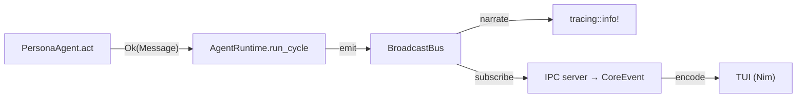

# Plan: 2.5 — Agent Observability Enrichment

## Goal

Close the observability gap: events are emitted via `tracing` but there is **no aggregation, no
metrics, and no token/cost tracking**. This plan adds token-usage extraction from provider
responses, per-agent metrics aggregation, IPC surfacing for TUI rendering, and a CLI metrics
summary — all within the existing hexagonal architecture.

## Background

The current observability stack works like this:



**What exists:**
- `RuntimeEvent` with 8 variants (Observing, Thinking, Acting, Reflected, Acted, Failed, Published, Lifecycle)
- `BroadcastBus<RuntimeEvent>` for fan-out
- `CoreEvent::Metric { name, value }` already defined in the IPC protocol (ready but unused)
- All three LLM adapters (Ollama, OpenAI, Gemini) discard the `usage` block from provider responses

**What's missing:**
- `CompletionResponse` only carries `content: String` — no token counts, no latency
- No aggregation of events into per-agent statistics
- No metrics emitted through IPC for TUI rendering
- No way to query session-level metrics

### What This Plan Does NOT Do (Future Work)

- Real-time TUI dashboard widget (requires Nim/Tatui frontend work)
- Cost estimation with per-model pricing (requires a pricing database)
- Exportable audit logs to file (requires persistence layer)
- Performance histograms or percentile tracking

---

## Proposed Changes

### 1. Domain — `src/domain/ports/llm_provider.rs` [MODIFY]

Enrich `CompletionResponse` with optional token usage data:

```diff
 /// A completion produced by a provider.
 #[derive(Debug, Clone, PartialEq, Eq, Serialize, Deserialize)]
 pub struct CompletionResponse {
     /// The generated text.
     pub content: String,
+    /// Token usage reported by the provider, if available.
+    #[serde(skip_serializing_if = "Option::is_none", default)]
+    pub usage: Option<TokenUsage>,
+}
+
+/// Token counts reported by a provider for a single completion.
+#[derive(Debug, Clone, Copy, PartialEq, Eq, Serialize, Deserialize)]
+pub struct TokenUsage {
+    /// Tokens consumed by the prompt/context.
+    pub prompt_tokens: u64,
+    /// Tokens generated in the completion.
+    pub completion_tokens: u64,
 }
```

This is a **backwards-compatible** change: `usage` is `Option` with `#[serde(default)]`,
so all existing code that constructs `CompletionResponse { content }` will continue to compile
with a minor update to add `usage: None`.

**Impact:** Every test and mock that constructs a `CompletionResponse` needs the new field.
These are mechanical additions (`usage: None`).

---

### 2. Infrastructure — LLM Adapters [MODIFY]

Parse the `usage` block from each provider's JSON response:

#### `src/infrastructure/llm/ollama.rs`

Ollama's `/api/generate` response includes `prompt_eval_count` and `eval_count`:

```diff
 200 => {
     let value: serde_json::Value = resp.json().await...;
     let content = value.get("response")...;
+    let usage = parse_ollama_usage(&value);
     Ok(CompletionResponse {
         content: content.to_string(),
+        usage,
     })
 }
```

```rust
fn parse_ollama_usage(value: &serde_json::Value) -> Option<TokenUsage> {
    let prompt = value.get("prompt_eval_count")?.as_u64()?;
    let completion = value.get("eval_count")?.as_u64()?;
    Some(TokenUsage {
        prompt_tokens: prompt,
        completion_tokens: completion,
    })
}
```

#### `src/infrastructure/llm/openai.rs`

OpenAI's `/chat/completions` response includes `usage.prompt_tokens` and
`usage.completion_tokens`:

```rust
fn parse_openai_usage(value: &serde_json::Value) -> Option<TokenUsage> {
    let usage = value.get("usage")?;
    let prompt = usage.get("prompt_tokens")?.as_u64()?;
    let completion = usage.get("completion_tokens")?.as_u64()?;
    Some(TokenUsage { prompt_tokens: prompt, completion_tokens: completion })
}
```

#### `src/infrastructure/llm/gemini.rs`

Gemini's response includes `usageMetadata.promptTokenCount` and
`usageMetadata.candidatesTokenCount`:

```rust
fn parse_gemini_usage(value: &serde_json::Value) -> Option<TokenUsage> {
    let meta = value.get("usageMetadata")?;
    let prompt = meta.get("promptTokenCount")?.as_u64()?;
    let completion = meta.get("candidatesTokenCount")?.as_u64()?;
    Some(TokenUsage { prompt_tokens: prompt, completion_tokens: completion })
}
```

All parsers return `Option` — if the provider doesn't include usage data, the field is `None`.
No panics, no unwraps.

---

### 3. Application — `src/application/agent_metrics.rs` [NEW]

A new pure-application-layer module that aggregates per-agent statistics. No I/O — it
consumes `RuntimeEvent`s and `TokenUsage` data.

```rust
//! Per-agent metrics aggregation for observability.

use std::collections::HashMap;
use std::time::Duration;
use crate::domain::models::AgentId;
use crate::domain::ports::TokenUsage;

/// Accumulated metrics for a single agent.
#[derive(Debug, Clone, Default)]
pub struct AgentStats {
    /// Total cognitive cycles run.
    pub cycles: u64,
    /// Successful completions (act produced a message).
    pub successes: u64,
    /// Failed completions (act returned an error).
    pub failures: u64,
    /// Total prompt tokens consumed.
    pub prompt_tokens: u64,
    /// Total completion tokens generated.
    pub completion_tokens: u64,
    /// Total time spent in act() calls.
    pub total_latency: Duration,
}

impl AgentStats {
    /// Total tokens (prompt + completion).
    pub fn total_tokens(&self) -> u64 {
        self.prompt_tokens + self.completion_tokens
    }

    /// Success rate as a fraction [0.0, 1.0].
    pub fn success_rate(&self) -> f64 {
        if self.cycles == 0 { return 0.0; }
        self.successes as f64 / self.cycles as f64
    }
}

/// Aggregates metrics across all agents in a session.
#[derive(Debug, Clone, Default)]
pub struct AgentMetrics {
    stats: HashMap<AgentId, AgentStats>,
}

impl AgentMetrics {
    pub fn new() -> Self { Self::default() }

    /// Record a completed cycle for an agent.
    pub fn record_cycle(&mut self, agent: &AgentId, success: bool,
                        usage: Option<TokenUsage>, latency: Duration) {
        let entry = self.stats.entry(agent.clone()).or_default();
        entry.cycles += 1;
        if success { entry.successes += 1; } else { entry.failures += 1; }
        if let Some(u) = usage {
            entry.prompt_tokens += u.prompt_tokens;
            entry.completion_tokens += u.completion_tokens;
        }
        entry.total_latency += latency;
    }

    /// Get stats for a specific agent.
    pub fn stats(&self, agent: &AgentId) -> Option<&AgentStats> {
        self.stats.get(agent)
    }

    /// Session-wide totals.
    pub fn session_totals(&self) -> AgentStats { ... }

    /// All per-agent stats, sorted by agent ID for determinism.
    pub fn all_stats(&self) -> Vec<(&AgentId, &AgentStats)> { ... }
}
```

**Tests:**
- `record_cycle_increments_counts` — single agent, multiple cycles
- `session_totals_aggregate_all_agents` — multi-agent summation
- `success_rate_is_correct` — 0 cycles returns 0.0
- `usage_accumulates_tokens` — optional usage tracking

---

### 4. Application — `src/application/agent_runtime.rs` [MODIFY]

Wire metrics collection into the cognitive cycle:

```diff
 pub struct AgentRuntime {
     events: BroadcastBus<RuntimeEvent>,
     agent_bus: BroadcastBus<Message>,
     registry: Arc<RwLock<HashMap<AgentId, AgentEntry>>>,
+    metrics: Arc<RwLock<AgentMetrics>>,
 }
```

In `run_cycle()`, measure latency around `agent.act()` and record the result:

```diff
                 emit(&events, RuntimeEvent::AgentActing { agent: id.clone() }).await;
+                let act_start = std::time::Instant::now();
                 match agent.act().await {
                     Ok(output) => {
+                        let latency = act_start.elapsed();
                         // ... existing reflect/emit logic ...
+                        // Record metrics
+                        let usage = /* extracted from act result, see below */;
+                        metrics.write().await.record_cycle(&id, true, usage, latency);
                         output
                     }
                     Err(error) => {
+                        let latency = act_start.elapsed();
+                        metrics.write().await.record_cycle(&id, false, None, latency);
                         // ... existing error emit ...
                         None
                     }
                 }
```

> [!IMPORTANT]
> **Design Decision: How does token usage flow from `act()` to metrics?**
>
> The `Role::act()` trait currently returns `Result<Option<Message>, LlmError>` — it doesn't
> carry usage data. To avoid changing the trait (which would cascade into every `Role`
> implementor), the plan takes the simpler approach:
>
> **Option A (chosen):** Extend the `Role` trait's `act()` return type to include optional usage:
> `Result<Option<(Message, Option<TokenUsage>)>, LlmError>`. This is a clean but breaking change
> to the trait, requiring all implementors to be updated.
>
> **Option B:** Add a separate `last_usage(&self) -> Option<TokenUsage>` method to the `Role`
> trait with a default `None` implementation. Only `PersonaAgent` overrides it. Less invasive.
>
> I'm going with **Option B** (least invasive, backwards-compatible default).

New method on `AgentRuntime`:

```rust
/// Snapshot current metrics.
pub async fn metrics(&self) -> AgentMetrics {
    self.metrics.read().await.clone()
}
```

---

### 5. Domain — `src/domain/ports/role.rs` [MODIFY]

Add an optional `last_usage()` method with a default implementation:

```diff
 #[async_trait]
 pub trait Role: Send + Sync {
     fn id(&self) -> &AgentId;
     fn observe(&mut self, input: &[Message]);
     fn think(&mut self) -> ThinkingOutput;
     async fn act(&mut self) -> Result<Option<Message>, LlmError>;
     fn reflect(&self, output: &Message) -> ReflectionOutput;
+
+    /// Token usage from the most recent act() call, if tracked.
+    fn last_usage(&self) -> Option<TokenUsage> { None }
 }
```

---

### 6. Application — `src/application/persona_agent.rs` [MODIFY]

Store usage from the last LLM call and implement `last_usage()`:

```diff
 pub struct PersonaAgent {
     ...
+    last_usage: Option<TokenUsage>,
 }
```

In `act()`:

```diff
     let response = self.provider.complete(request).await?;
+    self.last_usage = response.usage;
     self.last_thinking = None;
```

Override `last_usage()`:

```rust
fn last_usage(&self) -> Option<TokenUsage> {
    self.last_usage
}
```

---

### 7. Application — `src/application/agent_observability.rs` [MODIFY]

Add a `RuntimeEvent` variant for metrics snapshots:

```diff
+    /// A per-agent metrics snapshot emitted after a cycle.
+    AgentMetricsSnapshot {
+        agent: AgentId,
+        cycles: u64,
+        successes: u64,
+        failures: u64,
+        prompt_tokens: u64,
+        completion_tokens: u64,
+        latency_ms: u64,
+    },
```

This variant is emitted after each cycle completes, carrying the accumulated metrics for the
agent. The IPC server maps it to `CoreEvent::Metric` events for the TUI.

---

### 8. Application — `src/application/mod.rs` [MODIFY]

Add `pub mod agent_metrics;` and re-export `AgentMetrics`.

---

### 9. Documentation — `docs/Product_Engineering/FEATURE_MAP.md` [MODIFY]

Update item 2.5:

```diff
-- **What It Does Today:** `RuntimeEvent` with 5 variants (Observing, Thinking, Acting, Acted,
-  Failed) emitted via structured `tracing`.
-- **What It Should Do:** Real-time dashboard in TUI. Token usage per agent per cycle. Cost
-  estimation. Performance metrics (latency, success rate). Exportable audit logs.
-- **Gap:** Events are emitted to tracing only — no aggregation, no dashboard, no cost tracking.
+- **What It Does Today:** `RuntimeEvent` with 9 variants emitted via structured `tracing`.
+  Per-agent metrics aggregation tracks cycles, successes, failures, token usage (prompt +
+  completion), and latency. Token usage is extracted from all three LLM provider responses
+  (Ollama, OpenAI, Gemini). Metrics snapshots are emitted as `CoreEvent::Metric` for TUI
+  rendering.
+- **What It Should Do:** Real-time TUI dashboard widget. Cost estimation with per-model pricing.
+  Exportable audit logs to file. Performance histograms.
+- **Gap:** No TUI dashboard widget (requires Nim frontend). No cost estimation. No exportable
+  audit logs. No percentile tracking.
```

---

## Architecture Compliance

| Invariant | Compliance |
|-----------|-----------|
| Domain pure (no I/O) | ✅ `TokenUsage` is a pure value object. `AgentMetrics` is application-layer with no I/O |
| Async safety | ✅ `metrics` uses `Arc<tokio::sync::RwLock<T>>` |
| No unwrap/expect/panic | ✅ All usage parsing returns `Option`, all paths use `?` |
| Observability via tracing | ✅ New events narrate through `tracing` |
| Architecture boundaries | ✅ `TokenUsage` in domain ports, `AgentMetrics` in application, parsing in infrastructure |
| IPC boundary | ✅ Uses existing `CoreEvent::Metric` — no protocol version bump needed |

---

## Verification Plan

### Automated Tests

```bash
cargo fmt --all --check
cargo clippy --all-targets -- -D warnings
cargo test --all-targets
```

#### New Tests

| Test | File | Validates |
|------|------|-----------|
| `record_cycle_increments_counts` | `agent_metrics.rs` | Per-agent cycle counting |
| `session_totals_aggregate_all_agents` | `agent_metrics.rs` | Cross-agent summation |
| `success_rate_is_correct` | `agent_metrics.rs` | Edge case: 0 cycles |
| `usage_accumulates_tokens` | `agent_metrics.rs` | Optional usage aggregation |
| `parse_ollama_usage_extracts_tokens` | `ollama.rs` | Ollama response parsing |
| `parse_openai_usage_extracts_tokens` | `openai.rs` | OpenAI response parsing |
| `parse_gemini_usage_extracts_tokens` | `gemini.rs` | Gemini response parsing |
| `missing_usage_returns_none` | `ollama.rs` | Graceful degradation |
| `last_usage_returns_none_by_default` | `role.rs` or `persona_agent.rs` | Default trait impl |
| `metrics_snapshot_event_narrates` | `agent_observability.rs` | New variant tracing |

### Manual Verification

1. Run `cargo test --all-targets` — all tests pass
2. Run `scripts/quality-gate.sh` — full gate passes

---

## Model Recommendation

**Gemini 3.1 Pro (Low)** — This is mechanical struct enrichment, Option plumbing through three
adapter parsers, and a new aggregation struct with arithmetic. No architectural decisions or
complex reasoning required.
