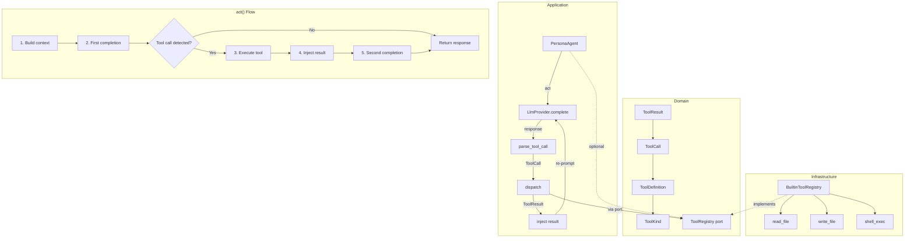

# Implementation Plan: Domain 2.9 — Agent Tool Use

## Goal

Give Maestro agents the ability to **interact with the environment** — read files, write files, and execute shell commands — closing the **#2 competitive disadvantage** identified in [FEATURE_MAP.md](file:///home/bro/projects/maestro-harness/docs/Product_Engineering/FEATURE_MAP.md) item 2.9.

### Current State

Today, agents can **only generate text** via `LlmProvider::complete()`. The `PersonaAgent::act()` method sends a prompt and receives a string response — there is no mechanism to dispatch tool calls, interpret structured tool invocations in the LLM output, or feed tool results back into the conversation.

**How act() works today** ([persona_agent.rs](file:///home/bro/projects/maestro-harness/src/application/persona_agent.rs#L127-L181)):

```rust
async fn act(&mut self) -> Result<Option<Message>, LlmError> {
    // ... build messages context ...
    let request = CompletionRequest { model, messages };
    let response = self.provider.complete(request).await?;
    // Returns the raw text as a Message — no tool parsing
    let message = Message::assistant(self.persona.id.clone(), response.content)?;
    Ok(Some(message))
}
```

**What's missing:**
- Domain types for tool definitions, calls, and results
- A `ToolRegistry` port for dispatching tool calls
- Built-in tool implementations (file I/O, shell)
- Tool-call detection in LLM responses
- Tool-result injection into the conversation loop
- Governance gates for environment-affecting tools

### What This Plan Delivers (MLP Scope)

| # | Feature | Description |
|---|---------|-------------|
| 1 | **Tool domain model** | `ToolDefinition`, `ToolCall`, `ToolResult`, `ToolKind`, `ToolError` as pure domain types |
| 2 | **ToolRegistry port** | A trait for registering and dispatching tools, with approval metadata |
| 3 | **Built-in tools** | `read_file`, `write_file`, `shell_exec` — three foundational tools |
| 4 | **Agent integration** | `PersonaAgent` detects tool-call markers in LLM output, dispatches, and re-prompts |
| 5 | **Governance alignment** | Write/exec tools carry `requires_approval: true` for future gate integration |

### What Is Explicitly Deferred

> [!IMPORTANT]
> - **MCP (Model Context Protocol) client** — requires a separate protocol implementation
> - **LLM function-calling API** — provider-specific (OpenAI tools, Gemini function declarations); the MLP uses a text-pattern approach that works with any provider
> - **AST parsing / code analysis** — requires language-specific parsers
> - **Web search** — requires an API integration
> - **Git operations** — requires git2 or Command-based integration
> - **Interactive approval gates** — the MLP marks tools as `requires_approval` but does not block execution; full IPC approval flow is deferred

---

## User Review Required

> [!IMPORTANT]
> **Tool-call detection is text-pattern based.** The MLP approach detects a structured
> `[TOOL_CALL]` marker in LLM output (JSON block between delimiters). This works with
> **any** LLM provider (Ollama, OpenAI, Gemini) without requiring provider-specific
> function-calling APIs. The trade-off is that it depends on the LLM following the
> format instructions in the system prompt.

> [!WARNING]
> **Shell execution introduces security surface.** Even in MLP scope, `shell_exec`
> will execute arbitrary commands. It is gated with `requires_approval: true` and
> bounded by a configurable timeout (default 30s), but there is no sandbox. The
> system prompt instructs agents that shell commands require human approval.

> [!IMPORTANT]
> **Tool results feed back into the LLM context.** When a tool call is detected,
> the agent performs a second completion with the tool result injected. This means
> a single `act()` call may make **2 LLM completions** (initial + follow-up).
> Token usage is accumulated across both calls.

---

## Proposed Changes

### 1. Domain — Tool model types

#### [NEW] [tool.rs](file:///home/bro/projects/maestro-harness/src/domain/models/tool.rs)

Pure domain types for the tool framework. No I/O, no provider SDKs.

```rust
//! Tool-use domain types.
//!
//! Defines the vocabulary for agent tool interactions: what tools exist,
//! how they are invoked, and what they return.

use serde::{Deserialize, Serialize};
use thiserror::Error;

/// The kind of tool — determines dispatch and governance policy.
#[derive(Debug, Clone, Copy, PartialEq, Eq, Serialize, Deserialize)]
#[serde(rename_all = "snake_case")]
pub enum ToolKind {
    /// Read a file from the project.
    FileRead,
    /// Write or create a file in the project.
    FileWrite,
    /// Execute a shell command.
    ShellExec,
}

impl ToolKind {
    /// Whether this tool kind requires explicit user approval before execution.
    pub fn requires_approval(self) -> bool {
        matches!(self, Self::FileWrite | Self::ShellExec)
    }

    /// Human-readable label for display.
    pub fn label(self) -> &'static str {
        match self {
            Self::FileRead => "read_file",
            Self::FileWrite => "write_file",
            Self::ShellExec => "shell_exec",
        }
    }
}

/// A tool definition in the registry.
#[derive(Debug, Clone, PartialEq, Eq, Serialize, Deserialize)]
pub struct ToolDefinition {
    /// Tool name (matches ToolKind label).
    pub name: String,
    /// Human-readable description shown to agents.
    pub description: String,
    /// The tool kind for dispatch.
    pub kind: ToolKind,
    /// Whether execution requires user approval.
    pub requires_approval: bool,
}

/// A tool invocation request parsed from LLM output.
#[derive(Debug, Clone, PartialEq, Eq, Serialize, Deserialize)]
pub struct ToolCall {
    /// Which tool to invoke.
    pub tool: String,
    /// Arguments as a JSON-compatible map.
    pub arguments: std::collections::BTreeMap<String, String>,
}

/// The outcome of executing a tool.
#[derive(Debug, Clone, PartialEq, Eq, Serialize, Deserialize)]
pub struct ToolResult {
    /// The tool that was called.
    pub tool: String,
    /// Whether the call succeeded.
    pub success: bool,
    /// Output content (file contents, command stdout, error message).
    pub output: String,
}

/// Errors from tool dispatch.
#[derive(Debug, Error)]
pub enum ToolError {
    #[error("unknown tool: {0}")]
    UnknownTool(String),
    #[error("missing argument: {0}")]
    MissingArgument(String),
    #[error("tool execution failed: {0}")]
    ExecutionFailed(String),
    #[error("tool requires approval")]
    RequiresApproval,
    #[error("tool timed out after {0}s")]
    Timeout(u64),
}
```

#### [MODIFY] [models/mod.rs](file:///home/bro/projects/maestro-harness/src/domain/models/mod.rs)

```diff
 pub mod rollback;
 pub mod routing;
 pub mod thinking;
+pub mod tool;

 ...
+pub use tool::{ToolCall, ToolDefinition, ToolError, ToolKind, ToolResult};
```

---

### 2. Domain — ToolRegistry port

#### [NEW] [ports/tool_registry.rs](file:///home/bro/projects/maestro-harness/src/domain/ports/tool_registry.rs)

```rust
//! `ToolRegistry` — port for dispatching tool calls.

use crate::domain::models::tool::{ToolCall, ToolDefinition, ToolError, ToolResult};

/// Port for registering and executing tools.
pub trait ToolRegistry: Send + Sync {
    /// List all available tool definitions.
    fn available_tools(&self) -> Vec<ToolDefinition>;

    /// Execute a tool call and return the result.
    fn execute(&self, call: &ToolCall) -> Result<ToolResult, ToolError>;
}
```

#### [MODIFY] [ports/mod.rs](file:///home/bro/projects/maestro-harness/src/domain/ports/mod.rs)

```diff
 pub mod session_store;
+pub mod tool_registry;

 ...
+pub use tool_registry::ToolRegistry;
```

---

### 3. Infrastructure — Built-in tools

#### [NEW] [builtin_tools.rs](file:///home/bro/projects/maestro-harness/src/infrastructure/builtin_tools.rs)

The three MLP tools implemented as a single `BuiltinToolRegistry`:

```rust
//! Built-in tool implementations (infrastructure layer).

use std::collections::BTreeMap;
use std::path::{Path, PathBuf};
use std::process::Command;
use std::time::Duration;

use crate::domain::models::tool::*;
use crate::domain::ports::tool_registry::ToolRegistry;

/// Default timeout for shell commands.
const SHELL_TIMEOUT_SECS: u64 = 30;
/// Maximum file size to read (bytes).
const MAX_READ_SIZE: u64 = 512_000; // 500 KB

/// Registry of built-in tools scoped to a project root.
pub struct BuiltinToolRegistry {
    project_root: PathBuf,
}

impl BuiltinToolRegistry {
    pub fn new(project_root: &Path) -> Self {
        Self {
            project_root: project_root.to_path_buf(),
        }
    }

    fn read_file(&self, args: &BTreeMap<String, String>) -> Result<ToolResult, ToolError> {
        let path_str = args
            .get("path")
            .ok_or_else(|| ToolError::MissingArgument("path".to_string()))?;
        let path = self.resolve_path(path_str);
        let metadata = std::fs::metadata(&path)
            .map_err(|e| ToolError::ExecutionFailed(format!("cannot stat {}: {e}", path.display())))?;
        if metadata.len() > MAX_READ_SIZE {
            return Err(ToolError::ExecutionFailed(format!(
                "file too large ({} bytes, max {})",
                metadata.len(),
                MAX_READ_SIZE
            )));
        }
        let content = std::fs::read_to_string(&path)
            .map_err(|e| ToolError::ExecutionFailed(format!("cannot read {}: {e}", path.display())))?;
        tracing::info!(path = %path.display(), bytes = content.len(), "tool: read_file");
        Ok(ToolResult {
            tool: "read_file".to_string(),
            success: true,
            output: content,
        })
    }

    fn write_file(&self, args: &BTreeMap<String, String>) -> Result<ToolResult, ToolError> {
        let path_str = args
            .get("path")
            .ok_or_else(|| ToolError::MissingArgument("path".to_string()))?;
        let content = args
            .get("content")
            .ok_or_else(|| ToolError::MissingArgument("content".to_string()))?;
        let path = self.resolve_path(path_str);
        if let Some(parent) = path.parent() {
            std::fs::create_dir_all(parent)
                .map_err(|e| ToolError::ExecutionFailed(format!("cannot create dirs: {e}")))?;
        }
        std::fs::write(&path, content)
            .map_err(|e| ToolError::ExecutionFailed(format!("cannot write {}: {e}", path.display())))?;
        tracing::info!(path = %path.display(), bytes = content.len(), "tool: write_file");
        Ok(ToolResult {
            tool: "write_file".to_string(),
            success: true,
            output: format!("wrote {} bytes to {}", content.len(), path.display()),
        })
    }

    fn shell_exec(&self, args: &BTreeMap<String, String>) -> Result<ToolResult, ToolError> {
        let command = args
            .get("command")
            .ok_or_else(|| ToolError::MissingArgument("command".to_string()))?;
        tracing::info!(command = command.as_str(), "tool: shell_exec");
        let output = Command::new("sh")
            .arg("-c")
            .arg(command)
            .current_dir(&self.project_root)
            .output()
            .map_err(|e| ToolError::ExecutionFailed(format!("cannot spawn shell: {e}")))?;
        let stdout = String::from_utf8_lossy(&output.stdout);
        let stderr = String::from_utf8_lossy(&output.stderr);
        let combined = if stderr.is_empty() {
            stdout.to_string()
        } else {
            format!("{stdout}\n[stderr]\n{stderr}")
        };
        // Truncate to prevent token explosion
        let truncated = if combined.len() > 4096 {
            format!("{}…(truncated)", &combined[..4096])
        } else {
            combined
        };
        Ok(ToolResult {
            tool: "shell_exec".to_string(),
            success: output.status.success(),
            output: truncated,
        })
    }

    /// Resolve a relative path against the project root.
    fn resolve_path(&self, path_str: &str) -> PathBuf {
        let p = Path::new(path_str);
        if p.is_absolute() {
            p.to_path_buf()
        } else {
            self.project_root.join(p)
        }
    }
}

impl ToolRegistry for BuiltinToolRegistry {
    fn available_tools(&self) -> Vec<ToolDefinition> {
        vec![
            ToolDefinition {
                name: "read_file".to_string(),
                description: "Read the contents of a file".to_string(),
                kind: ToolKind::FileRead,
                requires_approval: false,
            },
            ToolDefinition {
                name: "write_file".to_string(),
                description: "Write content to a file (creates parent dirs)".to_string(),
                kind: ToolKind::FileWrite,
                requires_approval: true,
            },
            ToolDefinition {
                name: "shell_exec".to_string(),
                description: "Execute a shell command in the project root".to_string(),
                kind: ToolKind::ShellExec,
                requires_approval: true,
            },
        ]
    }

    fn execute(&self, call: &ToolCall) -> Result<ToolResult, ToolError> {
        match call.tool.as_str() {
            "read_file" => self.read_file(&call.arguments),
            "write_file" => self.write_file(&call.arguments),
            "shell_exec" => self.shell_exec(&call.arguments),
            other => Err(ToolError::UnknownTool(other.to_string())),
        }
    }
}
```

#### [MODIFY] [infrastructure/mod.rs](file:///home/bro/projects/maestro-harness/src/infrastructure/mod.rs)

```diff
+pub mod builtin_tools;
 pub mod bus;
 pub mod config;
```

---

### 4. Application — Tool-call parser

#### [NEW] [tool_dispatch.rs](file:///home/bro/projects/maestro-harness/src/application/tool_dispatch.rs)

A module that parses tool-call markers from LLM output and dispatches them:

```rust
//! Tool-call detection and dispatch.
//!
//! Parses `[TOOL_CALL]...[/TOOL_CALL]` blocks from LLM output,
//! dispatches them through a `ToolRegistry`, and formats results
//! for re-injection into the conversation.

use crate::domain::models::tool::{ToolCall, ToolResult};
use crate::domain::ports::tool_registry::ToolRegistry;

/// Attempt to parse a tool call from LLM output.
/// Returns the parsed call and the surrounding text if found.
pub fn parse_tool_call(output: &str) -> Option<(ToolCall, String)> {
    let start_marker = "[TOOL_CALL]";
    let end_marker = "[/TOOL_CALL]";
    let start = output.find(start_marker)?;
    let end = output.find(end_marker)?;
    if end <= start {
        return None;
    }
    let json_str = &output[start + start_marker.len()..end].trim();
    let call: ToolCall = serde_json::from_str(json_str).ok()?;
    // Text before and after the tool call block
    let surrounding = format!(
        "{}{}",
        &output[..start].trim(),
        &output[end + end_marker.len()..].trim()
    );
    Some((call, surrounding))
}

/// Execute a tool call through the registry and format the result.
pub fn dispatch(registry: &dyn ToolRegistry, call: &ToolCall) -> ToolResult {
    match registry.execute(call) {
        Ok(result) => result,
        Err(e) => ToolResult {
            tool: call.tool.clone(),
            success: false,
            output: e.to_string(),
        },
    }
}

/// Format a tool result for injection into the LLM conversation.
pub fn format_result(result: &ToolResult) -> String {
    if result.success {
        format!(
            "[TOOL_RESULT tool=\"{}\" success=true]\n{}\n[/TOOL_RESULT]",
            result.tool, result.output
        )
    } else {
        format!(
            "[TOOL_RESULT tool=\"{}\" success=false]\n{}\n[/TOOL_RESULT]",
            result.tool, result.output
        )
    }
}

#[cfg(test)]
mod tests {
    use super::*;

    #[test]
    fn parses_valid_tool_call() {
        let output = r#"I need to read a file.
[TOOL_CALL]
{"tool": "read_file", "arguments": {"path": "src/main.rs"}}
[/TOOL_CALL]
Then I'll analyze it."#;
        let (call, surrounding) = parse_tool_call(output).unwrap();
        assert_eq!(call.tool, "read_file");
        assert_eq!(call.arguments.get("path").unwrap(), "src/main.rs");
        assert!(surrounding.contains("I need to read a file."));
        assert!(surrounding.contains("Then I'll analyze it."));
    }

    #[test]
    fn returns_none_for_no_marker() {
        assert!(parse_tool_call("just plain text").is_none());
    }

    #[test]
    fn returns_none_for_invalid_json() {
        let output = "[TOOL_CALL]\nnot json\n[/TOOL_CALL]";
        assert!(parse_tool_call(output).is_none());
    }

    #[test]
    fn formats_success_result() {
        let result = ToolResult {
            tool: "read_file".to_string(),
            success: true,
            output: "fn main() {}".to_string(),
        };
        let formatted = format_result(&result);
        assert!(formatted.contains("success=true"));
        assert!(formatted.contains("fn main() {}"));
    }

    #[test]
    fn formats_failure_result() {
        let result = ToolResult {
            tool: "read_file".to_string(),
            success: false,
            output: "file not found".to_string(),
        };
        let formatted = format_result(&result);
        assert!(formatted.contains("success=false"));
    }
}
```

#### [MODIFY] [application/mod.rs](file:///home/bro/projects/maestro-harness/src/application/mod.rs)

```diff
 pub mod demand_fingerprint;
+pub mod tool_dispatch;
```

---

### 5. Application — PersonaAgent tool integration

#### [MODIFY] [persona_agent.rs](file:///home/bro/projects/maestro-harness/src/application/persona_agent.rs)

The key change: `PersonaAgent` gains an **optional** `ToolRegistry` reference. When present, `act()` checks the LLM response for a `[TOOL_CALL]` block. If found, it dispatches the tool, injects the result, and performs a second completion.

**Struct changes:**

```diff
 pub struct PersonaAgent {
     persona: Persona,
     provider: Arc<dyn LlmProvider>,
     model: String,
     inbox: Vec<Message>,
     last_thinking: Option<ThinkingOutput>,
     last_usage: Option<TokenUsage>,
     memory: ShortTermMemory,
+    /// Optional tool registry for environment interaction.
+    tools: Option<Arc<dyn ToolRegistry>>,
 }
```

**Constructor changes:**

```diff
 impl PersonaAgent {
     pub fn new(persona: Persona, provider: Arc<dyn LlmProvider>, model: impl Into<String>) -> Self {
         Self {
             ...
             memory: ShortTermMemory::new(32),
+            tools: None,
         }
     }

+    /// Attach a tool registry to this agent.
+    pub fn with_tools(mut self, tools: Arc<dyn ToolRegistry>) -> Self {
+        self.tools = Some(tools);
+        self
+    }
```

**System prompt enhancement** — when tools are available, append a tools section:

```diff
     fn system_prompt(&self) -> String {
-        if !self.persona.system_prompt.is_empty() {
-            self.persona.system_prompt.clone()
-        } else { ... }
+        let mut prompt = if !self.persona.system_prompt.is_empty() {
+            self.persona.system_prompt.clone()
+        } else { ... };
+        if let Some(ref tools) = self.tools {
+            prompt.push_str("\n\n## Available Tools\n");
+            prompt.push_str("To use a tool, include a [TOOL_CALL]...[/TOOL_CALL] block:\n\n");
+            for tool in tools.available_tools() {
+                prompt.push_str(&format!(
+                    "- **{}**: {} {}\n",
+                    tool.name,
+                    tool.description,
+                    if tool.requires_approval { "(requires approval)" } else { "" }
+                ));
+            }
+            prompt.push_str("\nExample:\n");
+            prompt.push_str("[TOOL_CALL]\n{\"tool\": \"read_file\", \"arguments\": {\"path\": \"src/main.rs\"}}\n[/TOOL_CALL]\n");
+        }
+        prompt
     }
```

**Act() tool-call loop:**

```diff
     async fn act(&mut self) -> Result<Option<Message>, LlmError> {
         ...
         let response = self.provider.complete(request).await?;
-        self.last_usage = response.usage;
+        let mut total_usage = response.usage;
+
+        // Check for tool calls in the response
+        let final_content = if let Some(ref tools) = self.tools {
+            if let Some((call, surrounding_text)) =
+                crate::application::tool_dispatch::parse_tool_call(&response.content)
+            {
+                tracing::info!(
+                    agent = %self.persona.id,
+                    tool = call.tool.as_str(),
+                    "agent invoked tool"
+                );
+                let result = crate::application::tool_dispatch::dispatch(tools.as_ref(), &call);
+                let result_text = crate::application::tool_dispatch::format_result(&result);
+
+                // Re-prompt with the tool result
+                messages.push(Message::assistant(self.persona.id.clone(), response.content)
+                    .map_err(|e| LlmError::InvalidResponse(e.to_string()))?);
+                if let Ok(tool_msg) = Message::system(result_text) {
+                    messages.push(tool_msg);
+                }
+                let follow_up = CompletionRequest {
+                    model: self.model.clone(),
+                    messages,
+                };
+                let follow_up_response = self.provider.complete(follow_up).await?;
+                // Accumulate token usage
+                if let (Some(a), Some(b)) = (total_usage, follow_up_response.usage) {
+                    total_usage = Some(TokenUsage {
+                        prompt_tokens: a.prompt_tokens + b.prompt_tokens,
+                        completion_tokens: a.completion_tokens + b.completion_tokens,
+                    });
+                } else {
+                    total_usage = total_usage.or(follow_up_response.usage);
+                }
+                follow_up_response.content
+            } else {
+                response.content
+            }
+        } else {
+            response.content
+        };
+
+        self.last_usage = total_usage;
         self.last_thinking = None;
-        let message = Message::assistant(self.persona.id.clone(), response.content)
+        let message = Message::assistant(self.persona.id.clone(), final_content)
             .map_err(|e| LlmError::InvalidResponse(e.to_string()))?;
         Ok(Some(message))
     }
```

---

## Architecture Diagram



---

## Tests

### Domain — `tool.rs`

| Test | What It Validates |
|------|------------------|
| `file_read_does_not_require_approval` | `ToolKind::FileRead.requires_approval()` is false |
| `file_write_requires_approval` | `ToolKind::FileWrite.requires_approval()` is true |
| `shell_exec_requires_approval` | `ToolKind::ShellExec.requires_approval()` is true |
| `tool_call_serde_round_trip` | `ToolCall` serializes and deserializes correctly |
| `tool_result_serde_round_trip` | `ToolResult` serializes and deserializes correctly |

### Application — `tool_dispatch.rs`

| Test | What It Validates |
|------|------------------|
| `parses_valid_tool_call` | Extracts ToolCall from `[TOOL_CALL]...[/TOOL_CALL]` |
| `returns_none_for_no_marker` | Plain text has no tool call |
| `returns_none_for_invalid_json` | Malformed JSON is rejected |
| `formats_success_result` | Result formatting includes `success=true` |
| `formats_failure_result` | Result formatting includes `success=false` |

### Infrastructure — `builtin_tools.rs`

| Test | What It Validates |
|------|------------------|
| `read_file_returns_contents` | Reads a temp file successfully |
| `read_file_rejects_missing` | Missing file returns error |
| `write_file_creates_and_writes` | Creates parent dirs and writes |
| `shell_exec_runs_command` | Runs `echo hello` and captures output |
| `shell_exec_captures_stderr` | Stderr is included in output |
| `unknown_tool_is_rejected` | Unknown tool name returns `UnknownTool` |
| `available_tools_lists_three` | Registry lists 3 tools |

### Application — `persona_agent.rs`

| Test | What It Validates |
|------|------------------|
| `act_without_tools_works_unchanged` | Existing behavior preserved |
| `act_with_tools_dispatches_tool_call` | Mock provider returns tool-call pattern → tool is dispatched → second completion made |

---

## Verification Plan

### Automated Tests

```bash
# 1. Format
cargo fmt --all --check

# 2. Lint
cargo clippy --all-targets -- -D warnings

# 3. Unit + integration tests
cargo test --all-targets

# 4. Full quality gate
scripts/quality-gate.sh
```

### Manual Verification

1. Confirm `ToolKind` approval flags match governance intent
2. Confirm `parse_tool_call` handles edge cases (nested brackets, multiline JSON)
3. Confirm `BuiltinToolRegistry` scopes paths to project root
4. Confirm existing PersonaAgent tests pass unchanged (backward compat)

---

## Model & Category Recommendation

> [!NOTE]
> **Recommended model:** Gemini 3.1 Pro (Low) for the domain types and tool dispatch
> parser. The infrastructure tools are straightforward file/shell I/O. The persona_agent
> integration is the most delicate — it changes the core `act()` flow — and would
> benefit from Claude Opus (Thinking) for careful reasoning about the re-prompt loop
> and token accumulation.
