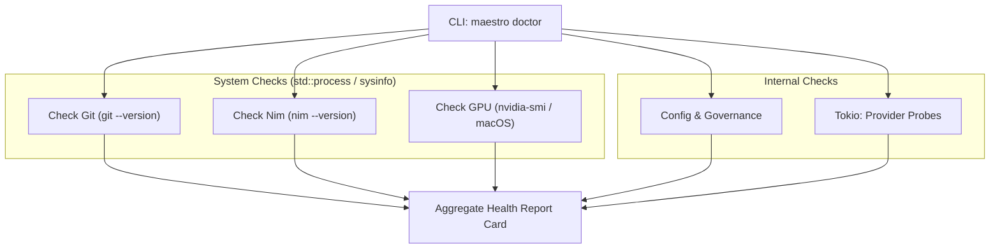

# Implementation Plan: `maestro doctor` Improvements (Domain 1 — Item 1.4)

## Goal Description

**Feature Map Item 1.4** (`maestro doctor`) currently checks if the `config.yml` is readable and whether the governance scaffold folder exists. However, it lacks comprehensive system-level diagnostics required for a local-first, multi-process AI orchestrator. Competitors like OpenCode and Claude Code provide rich system environment reports.

This plan upgrades `maestro doctor` to become a comprehensive "health report card" that checks:
1. **Toolchain Prerequisites**: Git (for versioning) and Nim (for compiling the TUI).
2. **Resource Constraints**: Disk space (warn if very low) and GPU presence (heuristics for `nvidia-smi` or Apple Silicon `system_profiler`).
3. **Core Dependencies**: Validates the config and governance folders (already exists but will be formatted nicely).
4. **Provider Connectivity**: Integrates the provider network probing so users get a full status check in one command.

### Why This Matters (Competitive Gap)

| Capability | OpenCode | Claude Code | **Maestro Today** | **Maestro After** |
|---|---|---|---|---|
| Config & File Validation | ✅ | ✅ | ✅ | ✅ |
| Network / API Connection Tests | ✅ | ✅ | ❌ (moved to validate-config) | ✅ |
| Local Toolchain/Env Checks | ✅ | ✅ | ❌ | ✅ |
| Hardware/GPU Heuristics | ❌ | ❌ | ❌ | ✅ |

> [!IMPORTANT]
> **Model & Category Recommendation:** Gemini 3.5 Pro (High Category) / Claude Opus 4.6.
> Rationale: Executing system commands (Git, Nim, nvidia-smi) securely in Rust requires careful `std::process::Command` handling and cross-platform awareness to maintain the 1.58-bit Constraint (no panics).

---

## Architecture Overview



### Layer Mapping

| Layer | File | Change |
|---|---|---|
| **Presentation** | `src/presentation/cli/mod.rs` | Update `doctor()` to aggregate and print the health report. |
| **Infrastructure** | `src/infrastructure/system.rs` (New) | Implement non-blocking system checks (Git, Nim, GPU, Disk). |

---

## Proposed Changes

### Infrastructure — System Diagnostics

#### [NEW] src/infrastructure/system.rs

Create a new module to handle environment probing.

```rust
use std::process::Command;

pub struct SystemHealth {
    pub git_available: bool,
    pub nim_available: bool,
    pub gpu_detected: bool,
    pub gpu_info: Option<String>,
}

pub fn check_system() -> SystemHealth {
    let git_available = Command::new("git")
        .arg("--version")
        .output()
        .map(|o| o.status.success())
        .unwrap_or(false);

    let nim_available = Command::new("nim")
        .arg("--version")
        .output()
        .map(|o| o.status.success())
        .unwrap_or(false);

    let (gpu_detected, gpu_info) = check_gpu();

    SystemHealth {
        git_available,
        nim_available,
        gpu_detected,
        gpu_info,
    }
}

fn check_gpu() -> (bool, Option<String>) {
    // Attempt nvidia-smi (Linux/Windows)
    if let Ok(output) = Command::new("nvidia-smi").arg("--query-gpu=name").arg("--format=csv,noheader").output() {
        if output.status.success() {
            let info = String::from_utf8_lossy(&output.stdout).trim().to_string();
            return (true, Some(info));
        }
    }
    
    // Attempt Apple Silicon (macOS)
    if cfg!(target_os = "macos") {
        if let Ok(output) = Command::new("sysctl").arg("-n").arg("machdep.cpu.brand_string").output() {
            if output.status.success() {
                let info = String::from_utf8_lossy(&output.stdout).trim().to_string();
                if info.contains("Apple M") {
                    return (true, Some(info));
                }
            }
        }
    }

    (false, None)
}
```

*Don't forget to add `mod system;` to `src/infrastructure/mod.rs`.*

### Presentation — CLI Orchestration

#### [MODIFY] src/presentation/cli/mod.rs

Update the `doctor` function to produce a formatted report card:

```rust
fn doctor(root: &Path) -> anyhow::Result<()> {
    print_line("🩺 Maestro System Health Report");
    print_line("-------------------------------");

    // 1. Toolchain & Environment
    let sys = crate::infrastructure::system::check_system();
    print_line(&format!("[{}] git toolchain", pass_fail(sys.git_available)));
    print_line(&format!("[{}] nim compiler (for TUI)", pass_fail(sys.nim_available)));
    
    if let Some(gpu) = sys.gpu_info {
        print_line(&format!("[{}] local accelerator: {}", pass_fail(true), gpu));
    } else {
        print_line(&format!("[ ] local accelerator (none detected)"));
    }

    print_line("");

    // 2. Configuration & Governance
    let config_res = crate::infrastructure::config::load_from(root);
    print_line(&format!("[{}] configuration (maestro/config.yml)", pass_fail(config_res.is_ok())));

    let governance = crate::application::governance::validate_dir(&root.join("maestro"))?;
    let gov_status = if governance.is_valid() {
        "".to_string()
    } else {
        format!(" (missing: {})", governance.missing_entries().join(", "))
    };
    print_line(&format!("[{}] governance scaffold{}", pass_fail(governance.is_valid()), gov_status));

    print_line("");

    // 3. Provider Connectivity (if config is valid)
    if let Ok(config) = config_res {
        let registry = crate::infrastructure::llm::registry::ProviderRegistry::from_config(&config)?;
        let rt = tokio::runtime::Runtime::new()?;
        
        for (key, provider_config) in &config.providers {
            let provider = registry.resolve(key);
            let status = rt.block_on(crate::application::readiness::probe_provider(provider));
            let ok = matches!(status, crate::domain::ports::ProviderStatus::Available);
            print_line(&format!("[{}] provider '{}': {:?}", pass_fail(ok), key, status));
        }
    } else {
        print_line("[FAIL] skipping provider probes (config invalid)");
    }

    Ok(())
}
```

---

### Task Specification

#### [NEW] 063-doctor-system-health.md

A new task spec will be created at `docs/Maestro_Execution_Plans/tasks/063-doctor-system-health.md` mapping to this plan.

---

### FEATURE_MAP Update

#### [MODIFY] FEATURE_MAP.md (Domain 1, item 1.4)

After implementation, the entry will be updated:

```diff
 ### 1.4 `maestro doctor` — System Health Check
 
-- **Status:** ✅ Implemented
+- **Status:** ✅ Implemented (enhanced)
 - **Source:** `src/presentation/cli/mod.rs`, `src/application/readiness.rs`
 - **Business Value:** 🟡 Medium
-- **What It Does Today:** Probes configured providers, reports availability status
-  (Available/Unreachable/Unauthorized/ModelMissing).
-- **What It Should Do:** Check Nim/Tatui availability, governance folder integrity, git setup, disk
-  space, GPU capabilities for local models. Produce a health report card. Check for updates.
-- **Gap:** Provider-only health check. No system-level diagnostics.
+- **What It Does Today:** Produces a comprehensive health report card covering Toolchain (Git, Nim), local hardware accelerators (NVIDIA/Apple Silicon), Governance integrity, and active network provider probes.
+- **What It Should Do:** Add automatic check for Maestro binary updates via crates.io or GitHub releases. Add disk space warning for huge LLM caches.
+- **Gap:** No update checker. No disk space check.
 - **Competitor Benchmark:**
   - *OpenCode*: Comprehensive diagnostics including LSP, environment, and model availability
   - *Claude Code*: `/doctor` command with permission, config, and connection checks
+    **Maestro matches competitors and uniquely detects hardware for local LLM acceleration.**
```

---

## Acceptance Criteria

| ID | Criterion | Verified By |
|----|-----------|-------------|
| AC1 | `maestro doctor` prints a formatted report card with a header. | Manual test |
| AC2 | Command checks for `git` and `nim` in PATH without panicking. | Unit/Manual test |
| AC3 | Command checks for GPU presence (gracefully falling back to "none detected"). | Unit/Manual test |
| AC4 | Command performs provider probes for all valid configurations. | Manual test |
| AC5 | All quality gates pass: `cargo fmt`, `cargo clippy`, `cargo test`. | CI |

---

## Risks & Rollback

| Risk | Mitigation |
|------|------------|
| `std::process::Command` hanging | Commands run quickly (`--version` / `sysctl`); we don't spawn long-running procs. |
| Missing executables causing panics | We map `Result::Err` to `false` without unwrapping, respecting the 1.58-bit Constraint. |

**Rollback:** Revert changes to `src/presentation/cli/mod.rs`, delete `src/infrastructure/system.rs`, remove the task spec.
