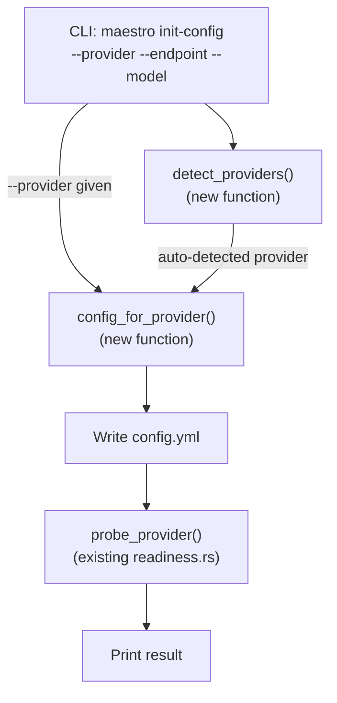

# Implementation Plan: `maestro init-config` Provider-Aware Setup (Domain 1 — Item 1.2)

## Goal Description

**Feature Map Item 1.2** (`maestro init-config`) currently writes a single, static `config.yml` template
to `maestro/`. Competitors like OpenCode and Claude Code offer interactive model selection, auto-discovery
of local providers, and instant connection tests on first run.

This plan upgrades `init-config` so that Maestro can:

1. **Accept a `--provider ollama|openai|gemini` flag** to pre-populate the correct provider block.
2. **Auto-detect a running Ollama instance** when no flag is given (environment-aware defaults).
3. **Run an instant connection test** against the configured provider after writing the config.
4. **Accept `--endpoint` and `--model` overrides** for full non-interactive CI/scripting support.
5. **Detect API keys in the environment** (`OPENAI_API_KEY`, `GEMINI_API_KEY`) and offer cloud providers when keys are present.

### Why This Matters (Competitive Gap)

| Capability | OpenCode | Claude Code | Aider | **Maestro Today** | **Maestro After** |
|---|---|---|---|---|---|
| Interactive provider selection on first run | ✅ | ✅ | ❌ | ❌ | ✅ |
| Auto-discover local Ollama | ✅ | ❌ | ✅ | ❌ | ✅ |
| Connection test at setup time | ✅ | ✅ | ❌ | ❌ | ✅ |
| `--provider` flag for CI | ❌ | ❌ | ✅ | ❌ | ✅ |
| Environment-aware API key detection | ✅ | ✅ | ✅ | ❌ | ✅ |

> [!IMPORTANT]
> **Model & Category Recommendation:** Gemini 3.5 Pro (High Category).
> Rationale: This task involves multi-file refactoring across presentation/infrastructure/application
> layers, async probe integration, and new CLI argument design — all requiring strong reasoning.

---

## User Review Required

> [!IMPORTANT]
> **Breaking Change:** The `InitConfig` CLI variant gains new optional fields (`--provider`,
> `--endpoint`, `--model`). The bare `maestro init-config` (no flags) behavior changes from
> "always write Ollama defaults" to "auto-detect, then write". The *output file format* does not change.

> [!WARNING]
> **Connection test is async.** The `init-config` command currently runs in synchronous CLI dispatch.
> We will use `tokio::runtime::Runtime::new()` at the CLI boundary to block on the probe — this is
> acceptable because `init-config` is a one-shot command, not part of the async server loop.

---

## Architecture Overview



### Layer Mapping

| Layer | File | Change |
|---|---|---|
| **Presentation** | `src/presentation/cli/mod.rs` | Add `--provider`/`--endpoint`/`--model` to `InitConfig`, refactor dispatch |
| **Presentation (new)** | `src/presentation/cli/providers.rs` | Provider detection, config template generation |
| **Application** | `src/application/readiness.rs` | Already exists — reused for connection probe |
| **Infrastructure** | `src/infrastructure/llm/registry.rs` | Already exists — reused to build provider for probe |
| **Domain** | No changes | Pure; no I/O added |

---

## Proposed Changes

### Presentation — CLI Argument Extension

#### [MODIFY] mod.rs

Add new fields to the `InitConfig` command variant and update dispatch:

```diff
 /// Top-level governance commands.
 #[derive(Debug, Subcommand)]
 pub enum Command {
     // ... existing variants ...
-    /// Generate `maestro/config.yml` from a template.
-    InitConfig,
+    /// Generate `maestro/config.yml` from a template, optionally for a specific provider.
+    InitConfig {
+        /// Provider kind: ollama, openai, or gemini.
+        #[arg(long)]
+        provider: Option<String>,
+        /// Override the default endpoint URL.
+        #[arg(long)]
+        endpoint: Option<String>,
+        /// Override the default model name.
+        #[arg(long)]
+        model: Option<String>,
+    },
     // ... remaining variants ...
 }
```

Update the dispatch arm:

```diff
-Some(Command::InitConfig) => {
-    let path = init_config(&root)?;
-    print_line(&format!("wrote {}", path.display()));
-}
+Some(Command::InitConfig { provider, endpoint, model }) => {
+    let result = providers::init_config_with_provider(
+        &root, provider, endpoint, model,
+    )?;
+    print_line(&format!("wrote {}", result.path.display()));
+    print_line(&format!("[{}] connection: {}", pass_fail(result.probe_ok), result.probe_msg));
+}
```

The existing `init_config(root)` function is kept as a private helper called internally by the
new `providers::init_config_with_provider`.

---

### Presentation — New Provider Module

#### [NEW] providers.rs

This module encapsulates provider detection, config template generation, and the connection-test
orchestration. It lives in `presentation/cli/` because it is CLI-specific logic (the domain and
application layers are not touched).

**Key types and functions:**

```rust
//! Provider-aware config generation for `maestro init-config`.

use std::path::{Path, PathBuf};

/// Result of an init-config operation.
pub struct InitConfigResult {
    /// Path to the written config file.
    pub path: PathBuf,
    /// Whether the connection probe succeeded.
    pub probe_ok: bool,
    /// Human-readable probe message.
    pub probe_msg: String,
}

/// Known provider presets.
#[derive(Debug, Clone, Copy, PartialEq, Eq)]
pub enum ProviderPreset {
    Ollama,
    OpenAi,
    Gemini,
}

impl ProviderPreset {
    /// Parse from a CLI string (case-insensitive).
    pub fn from_str_loose(s: &str) -> Result<Self, String> { ... }

    /// Default endpoint for each provider.
    pub fn default_endpoint(&self) -> &'static str { ... }

    /// Default model for each provider.
    pub fn default_model(&self) -> &'static str { ... }

    /// Environment variable name for the API key (None for Ollama).
    pub fn api_key_env(&self) -> Option<&'static str> { ... }
}

/// Detect which providers are available in the environment.
/// Checks: (1) Ollama at localhost:11434, (2) OPENAI_API_KEY set, (3) GEMINI_API_KEY set.
/// Returns the list of detected presets, best-first.
pub fn detect_providers() -> Vec<ProviderPreset> { ... }

/// Generate a config YAML string for the given preset + overrides.
pub fn config_for_provider(
    preset: ProviderPreset,
    endpoint: Option<&str>,
    model: Option<&str>,
) -> String { ... }

/// Main entry point: resolve provider, write config, probe connectivity.
pub fn init_config_with_provider(
    root: &Path,
    provider: Option<String>,
    endpoint: Option<String>,
    model: Option<String>,
) -> anyhow::Result<InitConfigResult> { ... }
```

**Detection logic** (synchronous — runs before async probe):

```rust
pub fn detect_providers() -> Vec<ProviderPreset> {
    let mut found = Vec::new();

    // 1. Check for a running Ollama instance (TCP connect to 127.0.0.1:11434)
    if std::net::TcpStream::connect_timeout(
        &"127.0.0.1:11434".parse().unwrap(),
        std::time::Duration::from_millis(500),
    ).is_ok() {
        found.push(ProviderPreset::Ollama);
    }

    // 2. Check for cloud API keys in the environment
    if std::env::var("OPENAI_API_KEY").ok().filter(|k| !k.is_empty()).is_some() {
        found.push(ProviderPreset::OpenAi);
    }
    if std::env::var("GEMINI_API_KEY").ok().filter(|k| !k.is_empty()).is_some() {
        found.push(ProviderPreset::Gemini);
    }

    found
}
```

**Config template generation** (per-provider):

```rust
pub fn config_for_provider(
    preset: ProviderPreset,
    endpoint: Option<&str>,
    model: Option<&str>,
) -> String {
    match preset {
        ProviderPreset::Ollama => format!(
            r#"system:
  default_provider: ollama
  default_model: {model}
  max_concurrency: 4
providers:
  ollama:
    kind: ollama
    endpoint: "{endpoint}"
    models:
      - name: {model}
"#,
            model = model.unwrap_or("mistral"),
            endpoint = endpoint.unwrap_or("http://127.0.0.1:11434/v1"),
        ),
        ProviderPreset::OpenAi => format!(
            r#"system:
  default_provider: openai
  default_model: {model}
  max_concurrency: 4
providers:
  openai:
    kind: openai
    endpoint: "{endpoint}"
    models:
      - name: {model}
  # API key is read from $OPENAI_API_KEY (never store keys in config files).
"#,
            model = model.unwrap_or("gpt-4o-mini"),
            endpoint = endpoint.unwrap_or("https://api.openai.com/v1"),
        ),
        ProviderPreset::Gemini => format!(
            r#"system:
  default_provider: gemini
  default_model: {model}
  max_concurrency: 4
providers:
  gemini:
    kind: gemini
    endpoint: "{endpoint}"
    models:
      - name: {model}
  # API key is read from $GEMINI_API_KEY (never store keys in config files).
"#,
            model = model.unwrap_or("gemini-2.0-flash"),
            endpoint = endpoint.unwrap_or("https://generativelanguage.googleapis.com"),
        ),
    }
}
```

**Main entry point** (write + probe):

```rust
pub fn init_config_with_provider(
    root: &Path,
    provider: Option<String>,
    endpoint: Option<String>,
    model: Option<String>,
) -> anyhow::Result<InitConfigResult> {
    // 1. Resolve which provider to use
    let preset = if let Some(ref p) = provider {
        ProviderPreset::from_str_loose(p)
            .map_err(|e| anyhow::anyhow!(e))?
    } else {
        // Auto-detect: pick the first available, default to Ollama
        let detected = detect_providers();
        if !detected.is_empty() {
            super::print_line(&format!(
                "auto-detected: {}",
                detected.iter().map(|p| p.name()).collect::<Vec<_>>().join(", ")
            ));
        }
        detected.into_iter().next().unwrap_or(ProviderPreset::Ollama)
    };

    // 2. Generate and write config
    let config_yaml = config_for_provider(
        preset,
        endpoint.as_deref(),
        model.as_deref(),
    );
    let dir = root.join("maestro");
    std::fs::create_dir_all(&dir)?;
    let path = dir.join("config.yml");
    if path.exists() {
        anyhow::bail!("config already exists at {}; delete it first to regenerate", path.display());
    }
    std::fs::write(&path, &config_yaml)?;

    // 3. Connection test
    let (probe_ok, probe_msg) = run_connection_test(root);

    Ok(InitConfigResult { path, probe_ok, probe_msg })
}
```

**Connection test** (async probe via a one-shot Tokio runtime):

```rust
fn run_connection_test(root: &Path) -> (bool, String) {
    let config = match crate::infrastructure::config::load_from(root) {
        Ok(c) => c,
        Err(e) => return (false, format!("config load failed: {e}")),
    };
    let registry = match crate::infrastructure::llm::registry::ProviderRegistry::from_config(&config) {
        Ok(r) => r,
        Err(e) => return (false, format!("provider build failed: {e}")),
    };
    let provider = registry.default_provider(&config);

    // Build a one-shot Tokio runtime for the probe — acceptable at CLI boundary
    let rt = match tokio::runtime::Runtime::new() {
        Ok(rt) => rt,
        Err(e) => return (false, format!("runtime error: {e}")),
    };
    let status = rt.block_on(crate::application::readiness::probe_provider(provider));
    match status {
        crate::domain::ports::ProviderStatus::Available => (true, "provider is reachable ✓".to_string()),
        crate::domain::ports::ProviderStatus::Unreachable => (false, "provider is unreachable — is it running?".to_string()),
        crate::domain::ports::ProviderStatus::Unauthorized => (false, "API key missing or rejected — check your environment variable".to_string()),
        crate::domain::ports::ProviderStatus::ModelMissing => (false, "endpoint reached but model not found — check model name".to_string()),
    }
}
```

---

### Task Specification

#### [NEW] 061-init-config-provider-aware.md

A new task spec will be created at `docs/Maestro_Execution_Plans/tasks/061-init-config-provider-aware.md`
with acceptance criteria mapped to this plan.

---

### FEATURE_MAP Update

#### [MODIFY] FEATURE_MAP.md (Domain 1, item 1.2)

After implementation, the entry will be updated:

```diff
 ### 1.2 `maestro init-config` — Config Bootstrap

-- **Status:** ✅ Implemented
-- **Source:** `src/presentation/cli/mod.rs`
-- **Business Value:** 🟢 Low
-- **What It Does Today:** Writes a default `config.yml` to `maestro/`.
-- **What It Should Do:** Support `--provider ollama|openai|gemini` to pre-populate provider block.
-  Interactive provider setup with connection test. Environment-aware defaults.
-- **Gap:** No provider pre-population, no interactive setup.
+- **Status:** ✅ Implemented (enhanced)
+- **Source:** `src/presentation/cli/mod.rs`, `src/presentation/cli/providers.rs`
+- **Business Value:** 🟡 Medium
+- **What It Does Today:** Supports `--provider ollama|openai|gemini` to pre-populate the correct
+  provider block. Auto-detects running Ollama and environment API keys. Runs an instant connection
+  test after config generation. Supports `--endpoint` and `--model` for CI/scripting.
+- **What It Should Do:** Full interactive TUI-based provider wizard with model browsing from live
+  Ollama catalog. Multi-provider config (configure all detected providers at once).
+- **Gap:** No interactive TUI wizard. No live model listing from Ollama `/api/tags`.
 - **Competitor Benchmark:**
   - *OpenCode*: Interactive model selection on first run, auto-discovers Ollama
-  - *Claude Code*: API key prompt on first launch, instant connection test
+  - *Claude Code*: API key prompt on first launch, instant connection test.
+    **Maestro now matches Claude Code's connection-test and OpenCode's auto-discovery.**
```

---

## Acceptance Criteria

| ID | Criterion | Verified By |
|----|-----------|-------------|
| AC1 | `maestro init-config --provider openai` writes a config with `default_provider: openai` and `endpoint: https://api.openai.com/v1` | Unit test |
| AC2 | `maestro init-config --provider gemini --model gemini-2.0-flash` writes a config with the correct model | Unit test |
| AC3 | `maestro init-config` (no flags) auto-detects a local Ollama if reachable and prints detection info | Unit test (mocked TCP) + manual |
| AC4 | After writing, a connection probe runs and the result is printed (`provider is reachable ✓` or diagnostic) | Unit test + manual |
| AC5 | `--endpoint` override replaces the default endpoint in the generated YAML | Unit test |
| AC6 | If config already exists, the command fails with a clear message (no silent overwrite) | Unit test |
| AC7 | All generated configs are valid (round-trip through `load_from` + `validate`) | Unit test |
| AC8 | All quality gates pass: `cargo fmt`, `cargo clippy`, `cargo test` | CI |

---

## Verification Plan

### Automated Tests

```bash
# 1. Formatting
cargo fmt --all --check

# 2. Lint
cargo clippy --all-targets -- -D warnings

# 3. All tests (including new provider tests)
cargo test --all-targets

# 4. Focused tests
cargo test -p maestro providers:: -- --nocapture
cargo test -p maestro presentation::cli::tests -- --nocapture
```

### Manual Verification

1. **Ollama auto-detection (if Ollama is running):**
   ```bash
   cd /tmp && mkdir test-initcfg && cd test-initcfg
   cargo run --manifest-path ~/projects/maestro-harness/Cargo.toml -- init-config
   cat maestro/config.yml
   # Expected: default_provider: ollama, connection test result printed
   ```

2. **Explicit provider selection:**
   ```bash
   cd /tmp && mkdir test-openai && cd test-openai
   cargo run --manifest-path ~/projects/maestro-harness/Cargo.toml -- init-config --provider openai --model gpt-4o
   cat maestro/config.yml
   # Expected: default_provider: openai, model: gpt-4o
   ```

3. **Duplicate config protection:**
   ```bash
   cargo run --manifest-path ~/projects/maestro-harness/Cargo.toml -- init-config --provider ollama
   cargo run --manifest-path ~/projects/maestro-harness/Cargo.toml -- init-config --provider ollama
   # Expected: second call fails with "config already exists"
   ```

---

## Risks & Rollback

| Risk | Mitigation |
|------|------------|
| TCP connect to Ollama adds ~500ms latency in offline environments | Timeout is 500ms; detection is skipped if `--provider` is explicit |
| Tokio runtime at CLI boundary | Standard pattern for one-shot async in CLI tools; only used for probe |
| New `--provider` flag changes `InitConfig` variant shape | Old bare `maestro init-config` still works (all args are `Option`) |

**Rollback:** Delete `src/presentation/cli/providers.rs`, revert `mod.rs` changes, delete task `061`. No database or external state is affected.
