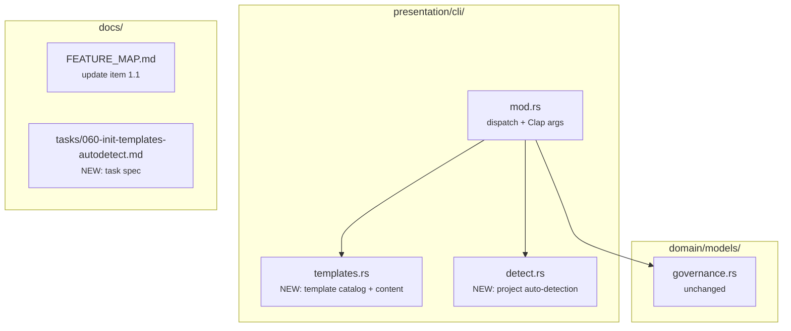

# Plan: Improve `maestro init` — Domain 1, Item 1.1

## Part 1: What Maestro Needs to Become a Relevant Competitor

Before diving into the init improvements, here is the strategic picture derived from the [Feature Map](file:///home/bro/projects/maestro-harness/docs/FEATURE_MAP.md).

### The Three Horizons

```mermaid
graph LR
    subgraph H1["Horizon 1 — Survive (0.4.0)"]
        S1["Streaming responses"]
        S2["Agent tool use<br/>(file edit, shell)"]
        S3["Rich instrumentation<br/>(prompts with context)"]
        S4["Verification that<br/>actually runs tests"]
    end
    subgraph H2["Horizon 2 — Compete (0.5.0)"]
        C1["Codebase RAG"]
        C2["Agent memory"]
        C3["Safety harness"]
        C4["Anthropic adapter"]
        C5["SOP engine"]
    end
    subgraph H3["Horizon 3 — Differentiate (0.6.0+)"]
        D1["MCP client/server"]
        D2["Inter-agent messaging"]
        D3["Semantic Two-Towers"]
        D4["Project templates ← this plan"]
        D5["Plugin system"]
    end
    H1 --> H2 --> H3
```



**Horizon 1 (Survive)** — Without streaming and tool use, Maestro feels broken relative to 2026 expectations. These are table-stakes.

**Horizon 2 (Compete)** — RAG, memory, and safety close the gap to where users would consider Maestro a viable alternative to Aider/OpenCode/Claude Code.

**Horizon 3 (Differentiate)** — These leverage Maestro's unique strengths (governance, multi-agent, FSM) and polish the onboarding experience. `maestro init` improvements live here — they make adoption smoother but don't gate competitive viability.

### Why Item 1.1 Matters Anyway

Even though `maestro init` is 🟡 Medium (not 🔴 Critical), it's the **first thing a new user touches**. A polished init sets the tone. Competitors have two strategies:

| Strategy | Used By | Maestro Equivalent |
|----------|---------|-------------------|
| **Zero-config** — just works in any directory | OpenCode, Aider | Maestro can't do this (governance folders are mandatory) |
| **Opinionated scaffold** — generates project structure | MetaGPT, Maestro | This is Maestro's path — make it *excellent* |

Since Maestro *requires* governance folders, the init experience must be fast, smart, and opinionated enough that the user gets value from the scaffolding rather than seeing it as friction.

---

## Part 2: Implementation Plan for Item 1.1

### Goal

Transform `maestro init` from a bare-bones interactive questionnaire into an intelligent project bootstrapper that:

1. **Auto-detects** existing project context (Cargo.toml, package.json, go.mod, etc.)
2. **Offers project templates** with pre-configured governance content
3. **Generates starter task specs** so the user can immediately start spec-driven development
4. **Supports `--template <name>`** for non-interactive, CI-friendly bootstrapping

### Architecture Decision

> [!IMPORTANT]
> **Templates are baked into the binary** (via `const` string slices), not fetched from a remote
> registry. This preserves Maestro's **local-first** philosophy and keeps `init` usable offline
> without network access. A future plugin system can add a remote template registry later.

### File Scope



---

### Proposed Changes

#### [NEW] `src/presentation/cli/detect.rs` — Project Auto-Detection

Pure function that inspects a directory for known project markers and returns a detection result.
No I/O beyond `Path::exists()` — keeps it testable.

```rust
//! Project auto-detection for `maestro init`.
//!
//! Scans the target directory for well-known project markers (Cargo.toml,
//! package.json, etc.) to infer project context and suggest defaults.

/// A detected project ecosystem.
#[derive(Debug, Clone, PartialEq, Eq)]
pub struct DetectedProject {
    /// Human-readable ecosystem name (e.g., "Rust (Cargo)").
    pub ecosystem: String,
    /// Suggested project template key (e.g., "cli-tool", "library").
    pub suggested_template: Option<String>,
    /// The marker file that triggered detection.
    pub marker: String,
}

/// Known project markers, ordered by specificity (most specific first).
const MARKERS: &[(&str, &str, Option<&str>)] = &[
    ("Cargo.toml",    "Rust (Cargo)",       Some("library")),
    ("package.json",  "Node.js (npm)",      Some("web-app")),
    ("go.mod",        "Go",                 Some("cli-tool")),
    ("pyproject.toml","Python (pyproject)",  Some("cli-tool")),
    ("setup.py",      "Python (setup.py)",  Some("cli-tool")),
    ("Makefile",      "Make-based project",  None),
    (".git",          "Git repository",      None),
];

/// Scan `dir` for known project markers.
///
/// Returns the first (most specific) match, or `None` if the directory
/// appears to be empty / unrecognised.
pub fn detect(dir: &std::path::Path) -> Option<DetectedProject> {
    for &(marker, ecosystem, template) in MARKERS {
        if dir.join(marker).exists() {
            return Some(DetectedProject {
                ecosystem: ecosystem.to_string(),
                suggested_template: template.map(String::from),
                marker: marker.to_string(),
            });
        }
    }
    None
}

#[cfg(test)]
mod tests {
    use super::*;

    #[test]
    fn detects_rust_project() {
        let dir = std::env::temp_dir().join(format!("maestro-detect-rust-{}", std::process::id()));
        std::fs::create_dir_all(&dir).unwrap();
        std::fs::write(dir.join("Cargo.toml"), "[package]\nname=\"x\"").unwrap();
        let result = detect(&dir);
        assert!(result.is_some());
        let d = result.unwrap();
        assert_eq!(d.ecosystem, "Rust (Cargo)");
        assert_eq!(d.suggested_template.as_deref(), Some("library"));
        assert_eq!(d.marker, "Cargo.toml");
        std::fs::remove_dir_all(&dir).ok();
    }

    #[test]
    fn detects_node_project() {
        let dir = std::env::temp_dir().join(format!("maestro-detect-node-{}", std::process::id()));
        std::fs::create_dir_all(&dir).unwrap();
        std::fs::write(dir.join("package.json"), "{}").unwrap();
        let result = detect(&dir);
        assert!(result.is_some());
        assert_eq!(result.unwrap().ecosystem, "Node.js (npm)");
        std::fs::remove_dir_all(&dir).ok();
    }

    #[test]
    fn returns_none_for_empty_dir() {
        let dir = std::env::temp_dir().join(format!("maestro-detect-empty-{}", std::process::id()));
        std::fs::create_dir_all(&dir).unwrap();
        assert!(detect(&dir).is_none());
        std::fs::remove_dir_all(&dir).ok();
    }

    #[test]
    fn most_specific_marker_wins() {
        // If both Cargo.toml and .git exist, Cargo.toml (more specific) wins.
        let dir = std::env::temp_dir().join(format!("maestro-detect-multi-{}", std::process::id()));
        std::fs::create_dir_all(dir.join(".git")).unwrap();
        std::fs::write(dir.join("Cargo.toml"), "").unwrap();
        let d = detect(&dir).unwrap();
        assert_eq!(d.marker, "Cargo.toml");
        std::fs::remove_dir_all(&dir).ok();
    }
}
```

---

#### [NEW] `src/presentation/cli/templates.rs` — Template Catalog

Contains the template definitions and their baked-in content. Each template provides:
- A description (shown to the user)
- A `config.yml` variant (with project-type-appropriate defaults)
- A starter scope markdown
- A starter task spec for `docs/Maestro_Execution_Plans/tasks/`
- An optional persona override

```rust
//! Project templates for `maestro init --template <name>`.
//!
//! Templates are baked into the binary to preserve the local-first philosophy.
//! Each template provides pre-configured governance content for a specific
//! project type.

/// A project template definition.
#[derive(Debug, Clone)]
pub struct ProjectTemplate {
    /// Template key (used with `--template <key>`).
    pub key: &'static str,
    /// Human-readable description.
    pub description: &'static str,
    /// Scope file content.
    pub scope_content: &'static str,
    /// Starter task spec content.
    pub task_spec: &'static str,
}

/// The built-in template catalog.
pub const TEMPLATES: &[ProjectTemplate] = &[
    ProjectTemplate {
        key: "web-app",
        description: "Web application (frontend + backend)",
        scope_content: "\
# Scope: Web Application

## Boundary
- Frontend: HTML/CSS/JS or framework (React, Vue, Svelte, etc.)
- Backend: API server with database
- Deployment: Container or serverless

## Constraints
- Must be responsive (mobile + desktop)
- Must pass Lighthouse performance audit ≥ 90
- Must include basic authentication

## Out of Scope
- Native mobile apps
- Real-time collaboration
",
        task_spec: "\
# Task 001: Web App Foundation

## Acceptance Criteria
- AC1: Project structure created with frontend and backend directories.
- AC2: Development server starts and serves a health-check endpoint.
- AC3: Basic HTML landing page renders in the browser.

## Risks
- Framework choice may constrain future architecture decisions.

## Rollback
- Delete the generated project directory.
",
    },
    ProjectTemplate {
        key: "cli-tool",
        description: "Command-line tool or utility",
        scope_content: "\
# Scope: CLI Tool

## Boundary
- A single binary (or script) invoked from the terminal
- Reads input from arguments, stdin, or config files
- Outputs structured text (plain, JSON, or table)

## Constraints
- Must support `--help` and `--version` flags
- Exit codes: 0 = success, 1 = user error, 2 = system error
- Must be cross-platform (Linux + macOS)

## Out of Scope
- GUI or TUI (unless explicitly requested)
- Daemon / long-running service mode
",
        task_spec: "\
# Task 001: CLI Foundation

## Acceptance Criteria
- AC1: Binary compiles and prints version with `--version`.
- AC2: `--help` shows usage with at least one subcommand.
- AC3: Non-zero exit code on invalid arguments.

## Risks
- Argument parser choice affects future extensibility.

## Rollback
- Delete the generated project directory.
",
    },
    ProjectTemplate {
        key: "library",
        description: "Reusable library or SDK",
        scope_content: "\
# Scope: Library

## Boundary
- Published as a package (crate, npm module, pip package, etc.)
- Public API surface must be documented
- Consumed by other projects, not end users

## Constraints
- Must have ≥ 80% test coverage on public API
- Must include API documentation with examples
- Semver versioning

## Out of Scope
- CLI wrapper (create a separate project)
- Application-specific logic
",
        task_spec: "\
# Task 001: Library Foundation

## Acceptance Criteria
- AC1: Package manifest exists with name, version, and license.
- AC2: At least one public type or function is exported.
- AC3: Unit test suite runs with at least one passing test.

## Risks
- API design decisions are hard to change after v1.0.

## Rollback
- Delete the generated project directory.
",
    },
    ProjectTemplate {
        key: "infra",
        description: "Infrastructure automation (scripts, IaC, deployment)",
        scope_content: "\
# Scope: Infrastructure Automation

## Boundary
- Scripts, configuration, or IaC modules for provisioning and deployment
- Targets: cloud providers, containers, CI/CD pipelines
- Idempotent operations preferred

## Constraints
- Must include a dry-run / plan mode before applying changes
- Must log all state-changing operations
- Secrets must never be committed to the repository

## Out of Scope
- Application code (this is infra only)
- Monitoring and alerting (separate concern)
",
        task_spec: "\
# Task 001: Infra Foundation

## Acceptance Criteria
- AC1: Directory structure matches target platform conventions.
- AC2: A dry-run / plan command executes without errors.
- AC3: A README documents prerequisites and usage.

## Risks
- Cloud provider API changes may break automation.

## Rollback
- Destroy provisioned resources using the inverse script.
",
    },
];

/// Look up a template by key (case-insensitive).
pub fn find(key: &str) -> Option<&'static ProjectTemplate> {
    TEMPLATES.iter().find(|t| t.key.eq_ignore_ascii_case(key))
}

/// List all available template keys with descriptions.
pub fn list() -> Vec<(&'static str, &'static str)> {
    TEMPLATES.iter().map(|t| (t.key, t.description)).collect()
}

#[cfg(test)]
mod tests {
    use super::*;

    #[test]
    fn find_returns_known_template() {
        assert!(find("web-app").is_some());
        assert!(find("cli-tool").is_some());
        assert!(find("library").is_some());
        assert!(find("infra").is_some());
    }

    #[test]
    fn find_is_case_insensitive() {
        assert!(find("Web-App").is_some());
        assert!(find("CLI-TOOL").is_some());
    }

    #[test]
    fn find_returns_none_for_unknown() {
        assert!(find("blockchain-dapp").is_none());
    }

    #[test]
    fn list_returns_all_templates() {
        let all = list();
        assert_eq!(all.len(), TEMPLATES.len());
        assert!(all.iter().any(|(k, _)| *k == "web-app"));
    }

    #[test]
    fn template_content_is_non_empty() {
        for t in TEMPLATES {
            assert!(!t.scope_content.is_empty(), "{} scope is empty", t.key);
            assert!(!t.task_spec.is_empty(), "{} task_spec is empty", t.key);
        }
    }
}
```

---

#### [MODIFY] `src/presentation/cli/mod.rs` — Updated CLI Surface

The changes to `mod.rs` are:

1. **Add `mod detect;` and `mod templates;`** declarations
2. **Add `--template` flag** to the `Init` command variant
3. **Update `init_project()`** to use auto-detection and templates
4. **Update `scaffold_project()`** to write template-based content + starter task spec
5. **Add `list-templates` command** so users can discover available templates
6. **Update `PROJECT_TYPES`** constant to use template keys instead

Key diffs:

```diff
@@ top of file — add module declarations
+mod detect;
+mod templates;
 
 use std::io::Write;
```

```diff
@@ Command enum — add --template flag and ListTemplates
     Init {
         /// Optional project name; prompted if omitted.
         name: Option<String>,
+        /// Use a project template for non-interactive setup.
+        #[arg(long)]
+        template: Option<String>,
     },
+    /// List available project templates.
+    ListTemplates,
```

```diff
@@ dispatch — wire up new commands
-        Some(Command::Init { name }) => init_project(name, cli.no_tui)?,
+        Some(Command::Init { name, template }) => init_project(name, template, cli.no_tui)?,
+        Some(Command::ListTemplates) => {
+            print_line("Available templates:");
+            for (key, desc) in templates::list() {
+                print_line(&format!("  {key:<12} — {desc}"));
+            }
+        }
```

```diff
@@ prompt_answers — show template keys instead of PROJECT_TYPES
-    write!(
-        out,
-        "Project type [library/Web/Desktop/Mobile] (optional): "
-    )?;
+    let template_keys: Vec<&str> = templates::TEMPLATES.iter().map(|t| t.key).collect();
+    write!(
+        out,
+        "Project template [{}] (optional): ",
+        template_keys.join("/")
+    )?;
     out.flush()?;
     let type_raw = read_line(&mut input)?;
-    let kind = PROJECT_TYPES
-        .iter()
-        .find(|t| t.eq_ignore_ascii_case(&type_raw))
-        .map(|t| (*t).to_string());
+    let kind = templates::find(&type_raw).map(|t| t.key.to_string());
```

```diff
@@ scaffold_project — write template content + starter task spec
 pub fn scaffold_project(root: &Path, answers: &InitAnswers) -> std::io::Result<Vec<String>> {
     let mut created = scaffold_markdown(root)?;
     let _ = init_config(root)?;
     created.push("config.yml".to_string());
 
     let slug: String = answers
         .scope
         .to_lowercase()
         .chars()
         .map(|c| if c.is_ascii_alphanumeric() { c } else { '_' })
         .collect();
-    let scope_path = root
-        .join("maestro")
-        .join("scopes")
-        .join(format!("{slug}.md"));
 
-    let mut body = format!(
-        "# Scope: {}\n\n- Project: {}\n",
-        answers.scope, answers.name
-    );
-    if let Some(kind) = &answers.kind {
-        body.push_str(&format!("- Type: {kind}\n"));
-    }
-    if !answers.layout_refs.is_empty() {
-        body.push_str("- Layout references:\n");
-        for reference in &answers.layout_refs {
-            body.push_str(&format!("  - {reference}\n"));
+    // Use template content if a known template was selected, otherwise fallback
+    let scope_path = root.join("maestro").join("scopes").join(format!("{slug}.md"));
+    let template = answers.kind.as_deref().and_then(templates::find);
+
+    if let Some(tmpl) = template {
+        // Write template-enriched scope
+        std::fs::write(&scope_path, tmpl.scope_content)?;
+        created.push(format!("scopes/{slug}.md"));
+
+        // Write starter task spec
+        let tasks_dir = root.join("maestro").join("tasks");
+        std::fs::create_dir_all(&tasks_dir)?;
+        let task_path = tasks_dir.join("001_initial_setup.md");
+        std::fs::write(&task_path, tmpl.task_spec)?;
+        created.push("tasks/001_initial_setup.md".to_string());
+    } else {
+        // Fallback: original minimal scope
+        let mut body = format!(
+            "# Scope: {}\n\n- Project: {}\n",
+            answers.scope, answers.name
+        );
+        if let Some(kind) = &answers.kind {
+            body.push_str(&format!("- Type: {kind}\n"));
         }
+        if !answers.layout_refs.is_empty() {
+            body.push_str("- Layout references:\n");
+            for reference in &answers.layout_refs {
+                body.push_str(&format!("  - {reference}\n"));
+            }
+        }
+        std::fs::write(&scope_path, body)?;
+        created.push(format!("scopes/{slug}.md"));
     }
-    std::fs::write(&scope_path, body)?;
-    created.push(format!("scopes/{slug}.md"));
     Ok(created)
 }
```

```diff
@@ init_project — add auto-detection and --template bypass
-fn init_project(name: Option<String>, no_tui: bool) -> anyhow::Result<()> {
+fn init_project(
+    name: Option<String>,
+    template: Option<String>,
+    no_tui: bool,
+) -> anyhow::Result<()> {
     let base = std::env::current_dir()?;
-    let stdin = std::io::stdin();
-    let answers = prompt_answers(stdin.lock(), std::io::stdout(), name)?;
+
+    // Auto-detect existing project context
+    let detected = detect::detect(&base);
+    if let Some(ref d) = detected {
+        print_line(&format!(
+            "detected {} project ({})",
+            d.ecosystem, d.marker
+        ));
+    }
+
+    // If --template is given, skip interactive prompts entirely
+    let answers = if let Some(ref tmpl_key) = template {
+        if templates::find(tmpl_key).is_none() {
+            let available: Vec<&str> = templates::TEMPLATES.iter().map(|t| t.key).collect();
+            anyhow::bail!(
+                "unknown template '{}'. Available: {}",
+                tmpl_key,
+                available.join(", ")
+            );
+        }
+        let resolved_name = name.unwrap_or_else(|| {
+            base.file_name()
+                .unwrap_or_default()
+                .to_string_lossy()
+                .into_owned()
+        });
+        InitAnswers {
+            name: resolved_name.clone(),
+            scope: resolved_name,
+            kind: Some(tmpl_key.clone()),
+            layout_refs: vec![],
+        }
+    } else {
+        // Auto-suggest name from directory
+        let suggested_name = name.or_else(|| {
+            detected.as_ref().map(|_| {
+                base.file_name()
+                    .unwrap_or_default()
+                    .to_string_lossy()
+                    .into_owned()
+            })
+        });
+        let stdin = std::io::stdin();
+        prompt_answers(stdin.lock(), std::io::stdout(), suggested_name)?
+    };
```

---

#### [NEW] `docs/Maestro_Execution_Plans/tasks/060-init-templates-autodetect.md` — Task Spec

Following the project's spec-driven development methodology:

```markdown
# TASK 060: Project Templates & Auto-Detection for `maestro init`

## 1. TASK SIGNATURE
* **Inputs:** `src/presentation/cli/mod.rs` (existing init flow)
* **Context Anchors:** #file:docs/FEATURE_MAP.md (Domain 1, item 1.1)
* **Expected Output:** Enhanced `maestro init` with template gallery,
  project auto-detection, starter task specs, and `--template <name>` flag.

## 2. ABSOLUTE CONSTRAINTS
* Templates are baked into the binary (no network fetch).
* `maestro init` still makes NO LLM calls.
* `--template` bypasses interactive prompts entirely.
* Auto-detection is best-effort; never blocks or errors on failure.
* Existing tests continue to pass unchanged.

## 3. ACCEPTANCE CRITERIA
* AC1: `maestro list-templates` prints ≥ 4 templates with descriptions.
* AC2: `maestro init --template web-app` creates governance folders + scope
  file + starter task spec non-interactively.
* AC3: Running `maestro init` inside a directory with `Cargo.toml` auto-
  suggests the directory name as project name and prints detection info.
* AC4: Template scope files contain meaningful boundary/constraint content
  (not placeholder text).
* AC5: All new functions have unit tests. All existing tests pass.

## 4. RISKS
* Adding templates increases binary size (negligible — ~5KB of embedded strings).
* Template content may not match all project variations (mitigated: templates
  are starting points, not constraints).

## 5. ROLLBACK
* Revert the three new/modified files. No database or external state.
```

---

#### [MODIFY] `docs/FEATURE_MAP.md` — Revalidate Item 1.1

After implementation, update lines 60-75:

```diff
-### 1.1 `maestro init` — Project Scaffolding
-
-- **Status:** ✅ Implemented
-- **Source:** `src/presentation/cli/mod.rs`
-- **Business Value:** 🟡 Medium
-- **What It Does Today:** Interactive prompts for project name, scope, kind, layout references.
-  Creates `maestro/` governance folders, `config.yml`, and scaffold structure.
-- **What It Should Do:** Template gallery (web app, CLI tool, library, infra automation). Auto-detect
-  existing project context (language, framework). Generate starter `.spec` files. Support
-  `--template <name>` flag for non-interactive bootstrap.
-- **Gap:** No templates, no project auto-detection, no starter specs.
-- **Competitor Benchmark:**
-  - *OpenCode*: Zero-config init — auto-discovers project from current directory
-  - *Aider*: No init needed — works with any existing Git repo immediately
-  - *MetaGPT*: Init generates PRD, system design, and API spec from a single sentence
+### 1.1 `maestro init` — Project Scaffolding
+
+- **Status:** ✅ Implemented (enhanced)
+- **Source:** `src/presentation/cli/mod.rs`, `src/presentation/cli/templates.rs`,
+  `src/presentation/cli/detect.rs`
+- **Business Value:** 🟡 Medium
+- **What It Does Today:** Interactive prompts with project auto-detection (Cargo.toml,
+  package.json, go.mod, etc.). Template gallery with 4 templates (web-app, cli-tool,
+  library, infra). Generates starter task specs in `maestro/tasks/`. Supports
+  `--template <name>` for non-interactive CI-friendly bootstrapping. `list-templates`
+  command shows available options.
+- **What It Should Do:** Community template registry (remote fetch, opt-in). AI-assisted
+  scope generation from a one-sentence description. Template composition (combine templates).
+  Framework-specific templates (e.g., "rust-axum-api", "react-nextjs").
+- **Gap:** Templates are generic (not framework-specific). No remote registry. No
+  AI-assisted generation.
+- **Competitor Benchmark:**
+  - *OpenCode*: Zero-config init — auto-discovers project from current directory
+  - *Aider*: No init needed — works with any existing Git repo immediately
+  - *MetaGPT*: Init generates PRD, system design, and API spec from a single sentence.
+    **Maestro now matches MetaGPT's template concept but not its AI-generated content.**
```

---

## Open Questions

> [!IMPORTANT]
> **Q1: Starter task spec location** — The current plan writes starter specs to `maestro/tasks/`.
> The project's own task specs live at `docs/Maestro_Execution_Plans/tasks/`. Should the starter
> spec go to `maestro/tasks/` (user's project governance) or `docs/Maestro_Execution_Plans/tasks/`
> (the Maestro project's own plans)? I recommend `maestro/tasks/` since this is the *user's*
> project, not Maestro's own development.

> [!IMPORTANT]
> **Q2: Backward compatibility** — The current `PROJECT_TYPES` constant uses
> `["library", "Web", "Desktop", "Mobile"]`. This plan replaces them with template keys
> `["web-app", "cli-tool", "library", "infra"]`. Existing users who typed "Web" or "Desktop"
> will get `None` for their `kind`. Since we're pre-v1.0 this should be acceptable, but want
> to confirm.

> [!IMPORTANT]
> **Q3: Remove `layout_refs`?** — The current init asks for "layout reference image paths" which
> seems like legacy from an earlier onboarding/interview flow. Should we keep it, or simplify the
> prompt? This plan keeps it unchanged, but it could be removed for a cleaner UX.

---

## Verification Plan

### Automated Tests (Red → Green)

```bash
# 1. Existing tests must pass unchanged
cargo test --all-targets 2>&1 | grep -E "^test |FAILED|ok"

# 2. New tests in detect.rs
cargo test -p maestro detect:: -- --nocapture

# 3. New tests in templates.rs
cargo test -p maestro templates:: -- --nocapture

# 4. Updated tests in cli/mod.rs
cargo test -p maestro presentation::cli::tests -- --nocapture

# 5. Formatting
cargo fmt --all --check
```

### Manual Verification

1. **Template listing**:
   ```bash
   cargo run -- list-templates
   ```
   Expected: prints 4 templates with descriptions.

2. **Non-interactive init with template**:
   ```bash
   cd /tmp && mkdir test-project && cd test-project
   cargo run --manifest-path /home/bro/projects/maestro-harness/Cargo.toml -- \
     init --template web-app --no-tui
   ```
   Expected: creates `test-project/maestro/{scopes/,personas/,skills/,tasks/,config.yml}` with no prompts.

3. **Auto-detection in existing Rust project**:
   ```bash
   cd /home/bro/projects/maestro-harness
   cargo run -- init --no-tui  # then type answers interactively
   ```
   Expected: prints "detected Rust (Cargo) project (Cargo.toml)" and pre-fills name suggestion.

4. **Unknown template error**:
   ```bash
   cargo run -- init --template banana --no-tui
   ```
   Expected: error message listing available templates.

---

## Model Recommendation

> [!NOTE]
> **Recommended model: Gemini 3.1 Pro (Low)**
>
> This is a presentation-layer change (CLI commands and static templates) with no async,
> no domain logic changes, and straightforward Rust string manipulation. The existing tests
> and architecture are well-documented. A low-tier model is sufficient and cost-effective
> for this implementation scope.
