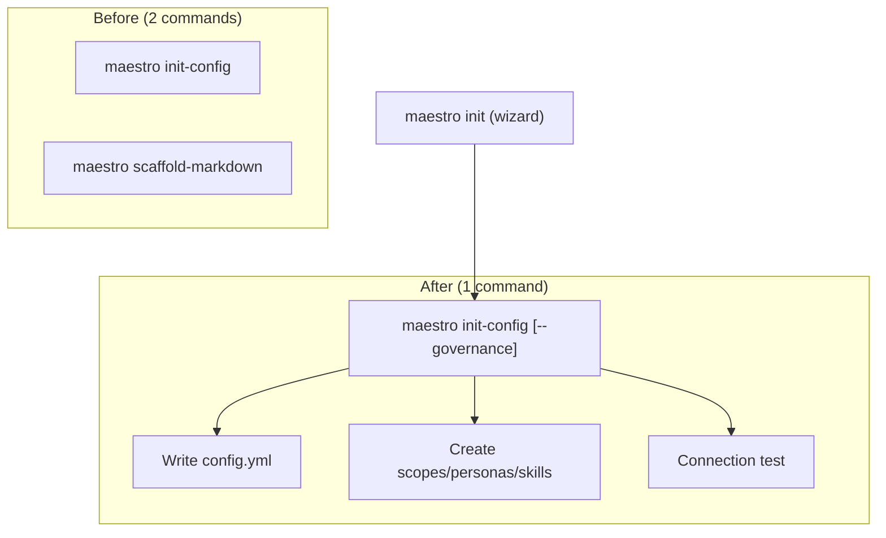

# Implementation Plan: Merge `scaffold-markdown` into `init-config --governance`

## Goal Description

Currently, setting up a Maestro project requires two separate commands:
1. `maestro init-config` — writes `maestro/config.yml`
2. `maestro scaffold-markdown` — creates the `maestro/{scopes,personas,skills}` governance folders

This plan **merges** `scaffold-markdown` into `init-config` as a `--governance` flag, so users get a single cohesive bootstrap command. The standalone `ScaffoldMarkdown` subcommand will be **removed** from the CLI enum (but the underlying `scaffold_markdown()` function remains as internal utility).

### Why This Matters

- **Reduced cognitive load**: One command instead of two for project setup.
- **Matches competitor UX**: OpenCode, Claude Code, and Aider all use a single setup command.
- **Governance-first philosophy**: When `--governance` is passed (or when no flags are given during `maestro init`), the governance folders are scaffolded alongside the config — reinforcing Maestro's governed execution model.

> [!IMPORTANT]
> **Model & Category Recommendation:** Claude Opus 4.6 (current model).
> Rationale: This is a refactoring task touching multiple call sites including the interactive wizard. The model's strong code-editing capabilities are well-suited.

---

## User Review Required

> [!WARNING]
> **Breaking Change:** The `maestro scaffold-markdown` subcommand will be **removed**. Any scripts or documentation referencing it will need to use `maestro init-config --governance` instead. The `maestro init` full wizard already calls both internally and will continue to work unchanged.

> [!IMPORTANT]
> **Interactive Wizard Impact:** The interactive menu (choice "5") currently maps to `scaffold-markdown`. It will be updated to call `init-config --governance` flow instead, but the menu text stays user-friendly.

---

## Architecture Overview



---

## Proposed Changes

### Presentation — CLI Struct & Dispatch

#### [MODIFY] src/presentation/cli/mod.rs

**1. Remove `ScaffoldMarkdown` from `Command` enum:**

```diff
 pub enum Command {
     /// Print version information.
     Version,
     ValidateConfig { ... },
     ListAgents { ... },
-    /// Create the mandatory governance markdown scaffold.
-    ScaffoldMarkdown,
     /// Generate `maestro/config.yml` from a template.
     InitConfig {
         #[arg(long)]
         provider: Option<String>,
         #[arg(long)]
         endpoint: Option<String>,
         #[arg(long)]
         model: Option<String>,
+        /// Also create governance folders (scopes, personas, skills).
+        #[arg(long)]
+        governance: bool,
     },
     ...
 }
```

**2. Update dispatch to remove `ScaffoldMarkdown` arm and pass `governance` to `init_config_with_provider`:**

```diff
-        Some(Command::ScaffoldMarkdown) => {
-            let created = scaffold_markdown(&root)?;
-            print_line(&format!("scaffolded governance: {}", created.join(", ")));
-        }
         Some(Command::InitConfig {
             provider,
             endpoint,
             model,
+            governance,
         }) => {
-            let result = providers::init_config_with_provider(&root, provider, endpoint, model)?;
+            let result = providers::init_config_with_provider(&root, provider, endpoint, model, governance)?;
             print_line(&format!("wrote {}", result.path.display()));
+            if !result.governance_created.is_empty() {
+                print_line(&format!("scaffolded governance: {}", result.governance_created.join(", ")));
+            }
             print_line(&format!(
                 "[{}] connection: {}",
                 pass_fail(result.probe_ok),
                 result.probe_msg
             ));
         }
```

**3. Update the interactive wizard menu (choice "5"):**

The old menu item "5. Scaffold governance folders" will become "5. Init config + governance" and call the combined flow.

```diff
             "5" => {
-                let created = scaffold_markdown(&root)?;
-                print_line(&format!("scaffolded governance: {}", created.join(", ")));
+                let result = providers::init_config_with_provider(&root, None, None, None, true)?;
+                print_line(&format!("wrote {}", result.path.display()));
+                if !result.governance_created.is_empty() {
+                    print_line(&format!("scaffolded governance: {}", result.governance_created.join(", ")));
+                }
+                print_line(&format!(
+                    "[{}] connection: {}",
+                    pass_fail(result.probe_ok),
+                    result.probe_msg
+                ));
                 break;
             }
```

**4. Keep the internal `scaffold_markdown()` function** — it is reused by `scaffold_project()` (the `maestro init` full wizard). Only the CLI subcommand is removed.

---

### Presentation — Providers Module

#### [MODIFY] src/presentation/cli/providers.rs

**1. Add `governance_created` field to `InitConfigResult`:**

```diff
 pub struct InitConfigResult {
     pub path: PathBuf,
     pub probe_ok: bool,
     pub probe_msg: String,
+    /// Governance folder names created (empty if --governance was not passed).
+    pub governance_created: Vec<String>,
 }
```

**2. Add `governance: bool` parameter to `init_config_with_provider`:**

```diff
 pub fn init_config_with_provider(
     root: &Path,
     provider: Option<String>,
     endpoint: Option<String>,
     model: Option<String>,
+    governance: bool,
 ) -> anyhow::Result<InitConfigResult> {
     ...
     // After writing config, optionally scaffold governance
+    let governance_created = if governance {
+        super::scaffold_markdown(root)?
+    } else {
+        Vec::new()
+    };
     
     Ok(InitConfigResult {
         path,
         probe_ok,
         probe_msg,
+        governance_created,
     })
 }
```

---

### Documentation

#### [MODIFY] docs/Product_Engineering/FEATURE_MAP.md

- **Item 1.6** will be marked as "✅ Merged into 1.2" with a note that governance scaffolding is now part of `init-config --governance`.

---

### Task Spec

#### [NEW] docs/Maestro_Execution_Plans/tasks/065-merge-scaffold-into-init-config.md

---

## Acceptance Criteria

| ID | Criterion | Verified By |
|----|-----------|-------------|
| AC1 | `maestro scaffold-markdown` subcommand no longer exists | CLI `--help` output |
| AC2 | `maestro init-config --governance` creates config + governance folders | Manual test |
| AC3 | `maestro init-config` (without `--governance`) only creates config | Manual test |
| AC4 | `maestro init` full wizard still scaffolds governance correctly | Existing test |
| AC5 | Interactive wizard menu choice "5" calls the combined flow | Manual test |
| AC6 | All quality gates pass: `cargo fmt`, `cargo clippy`, `cargo test` | CI |

---

## Verification Plan

### Automated Tests

```bash
cargo fmt --all --check
cargo clippy --all-targets -- -D warnings
cargo test --all-targets
```

The existing `scaffold_creates_governance_dirs` test will remain valid since the `scaffold_markdown()` function is kept. The `init_config_writes_template` test also stays valid.

### Manual Verification

```bash
# Test 1: Config-only (no governance)
rm -rf maestro && cargo run -- init-config
# → Should create maestro/config.yml but NOT scopes/personas/skills

# Test 2: Config + governance
rm -rf maestro && cargo run -- init-config --governance
# → Should create maestro/config.yml AND scopes/personas/skills

# Test 3: Confirm old command is gone
cargo run -- scaffold-markdown
# → Should show error: unrecognized subcommand
```

---

## Risks & Rollback

| Risk | Mitigation |
|------|------------|
| Breaking change for scripts using `scaffold-markdown` | Documented. Low risk — command is rarely used standalone in CI. |
| `maestro init` regression | `scaffold_project()` still calls `scaffold_markdown()` internally — no change to that path. |

**Rollback:** Re-add `ScaffoldMarkdown` variant to the `Command` enum and restore the dispatch arm.
