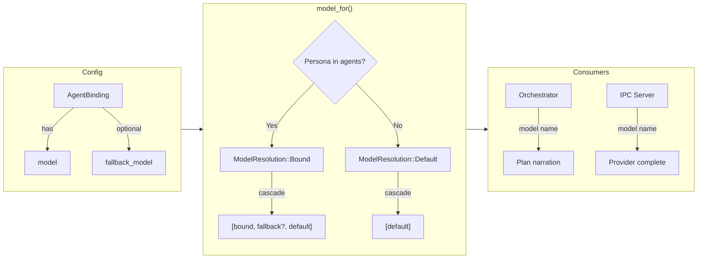

# Implementation Plan: Domain 2.7 — Per-Agent Model Routing Improvements

## Goal

Upgrade the static per-agent model routing from a single-model binding to a
**model cascade chain** with per-persona fallback models and narrated model resolution —
closing the gap identified in [FEATURE_MAP.md](file:///home/bro/projects/maestro-harness/docs/Product_Engineering/FEATURE_MAP.md)
item 2.7 while staying within the MLP boundary.

### Current State

The model router ([model_router.rs](file:///home/bro/projects/maestro-harness/src/application/model_router.rs))
is a single 6-line function:

```rust
pub fn model_for(config: &MaestroConfig, persona: &str) -> String {
    config.agents.get(persona)
        .map(|binding| binding.model.clone())
        .unwrap_or_else(|| config.system.default_model.clone())
}
```

The [AgentBinding](file:///home/bro/projects/maestro-harness/src/domain/models/config.rs#L47-L53)
has two fields: `provider` and `model`. There is no cascading, no fallback chain,
and no narration of which model was resolved for which persona.

**Limitations identified in the FEATURE_MAP:**
- Static single-model binding only
- No model cascading (try fast model first, escalate on failure)
- No per-task model selection based on complexity estimation
- No cost-aware routing
- No narration of model resolution decisions

### What This Plan Delivers (MLP Scope)

1. **Fallback model chain** — `AgentBinding` gains an optional `fallback_model` field, creating a prioritised list: persona-specific model → fallback model → system default
2. **Provider resolution** — `model_for` upgraded to return `(provider, model)` pairs to route through the correct provider, not just a model name string
3. **Narrated model resolution** — `tracing::info!` logging which model was resolved for each persona and why (bound, fallback, or default)
4. **Model resolution explanation** — Resolution details surfaced in the plan narration
5. **Updated FEATURE_MAP.md** — reflecting the new state

### What Is Explicitly Deferred

> [!IMPORTANT]
> The following are deferred to keep MLP scope manageable:
> - **Runtime cascading** (try fast model first, re-try on `LlmError` with fallback) — requires async retry logic in `PersonaAgent::act()`, significantly more complex
> - **Per-task complexity estimation** — requires a demand classifier, not yet designed
> - **Cost-aware routing** — requires per-model cost tables and token-budget tracking
> - **Live model switching** — mid-session model hot-swap

---

## User Review Required

> [!IMPORTANT]
> **YAML Config Change.** The `agents:` binding schema gains an optional `fallback_model`
> field. Existing configs remain valid (the field defaults to `None`). Example:
>
> ```yaml
> agents:
>   Software Engineer:
>     provider: ollama
>     model: codellama
>     fallback_model: mistral    # NEW — optional
>   Quality Assurance:
>     provider: ollama
>     model: mistral
>     # no fallback → falls through to system default
> ```

> [!IMPORTANT]
> **Return type change for `model_for`.** Currently returns `String` (model name only).
> The new signature returns `ModelResolution` — a struct with `provider`, `model`,
> `source` (bound/fallback/default), plus a `chain()` method listing the full
> cascade. All call sites (orchestrator, IPC server) will be updated.

---

## Proposed Changes

### 1. Domain — Expand `AgentBinding` in `config.rs`

#### [MODIFY] [config.rs](file:///home/bro/projects/maestro-harness/src/domain/models/config.rs)

Add the optional fallback field:

```diff
 pub struct AgentBinding {
     pub provider: String,
     pub model: String,
+    /// Optional fallback model on the same provider.
+    #[serde(default, skip_serializing_if = "Option::is_none")]
+    pub fallback_model: Option<String>,
 }
```

**Validation impact:** `MaestroConfig::validate()` must also validate `fallback_model`
against the provider's declared models when present.

```rust
// Inside the agent validation loop:
if let Some(ref fallback) = binding.fallback_model {
    if !model_exists(provider, fallback) {
        return Err(ConfigError::UnknownAgentModel {
            agent: agent.clone(),
            provider: binding.provider.clone(),
            model: fallback.clone(),
        });
    }
}
```

---

### 2. Application — Enhanced `model_router.rs`

#### [MODIFY] [model_router.rs](file:///home/bro/projects/maestro-harness/src/application/model_router.rs)

**Add `ModelResolution` struct:**

```rust
/// Describes how a model was resolved for a persona.
#[derive(Debug, Clone, PartialEq, Eq)]
pub struct ModelResolution {
    /// The provider key.
    pub provider: String,
    /// The resolved model name.
    pub model: String,
    /// How it was resolved.
    pub source: ResolutionSource,
    /// The full cascade chain (primary → fallback → default), for narration.
    pub cascade: Vec<String>,
}

/// Why this model was chosen.
#[derive(Debug, Clone, PartialEq, Eq)]
pub enum ResolutionSource {
    /// Persona had an explicit binding in config.
    Bound,
    /// Persona had a binding with a fallback, and fallback was selected.
    Fallback,
    /// No binding; system default was used.
    Default,
}
```

**Rewrite `model_for` to return `ModelResolution`:**

```rust
pub fn model_for(config: &MaestroConfig, persona: &str) -> ModelResolution {
    if let Some(binding) = config.agents.get(persona) {
        let mut cascade = vec![binding.model.clone()];
        if let Some(ref fallback) = binding.fallback_model {
            cascade.push(fallback.clone());
        }
        cascade.push(config.system.default_model.clone());

        tracing::info!(
            persona = persona,
            model = %binding.model,
            provider = %binding.provider,
            fallback = binding.fallback_model.as_deref().unwrap_or("none"),
            source = "bound",
            "model resolution"
        );

        ModelResolution {
            provider: binding.provider.clone(),
            model: binding.model.clone(),
            source: ResolutionSource::Bound,
            cascade,
        }
    } else {
        tracing::info!(
            persona = persona,
            model = %config.system.default_model,
            provider = %config.system.default_provider,
            source = "default",
            "model resolution"
        );

        ModelResolution {
            provider: config.system.default_provider.clone(),
            model: config.system.default_model.clone(),
            source: ResolutionSource::Default,
            cascade: vec![config.system.default_model.clone()],
        }
    }
}
```

---

### 3. Application — Update Orchestrator Call Sites

#### [MODIFY] [orchestrator.rs](file:///home/bro/projects/maestro-harness/src/application/orchestrator.rs)

The orchestrator currently uses `model_for: impl Fn(&str) -> String`. This changes to
return the model string (the orchestrator only needs the model name for the cascade
plan display, while the actual provider resolution happens in the server):

```diff
-    model_for: impl Fn(&str) -> String,
+    model_for: impl Fn(&str) -> String,
```

Actually, the orchestrator signature **stays the same** — it already accepts a
closure `Fn(&str) -> String`. The **call site** in the IPC server that builds this
closure will change to extract `resolution.model` from the new `ModelResolution`.
This keeps the orchestrator decoupled from config details.

The plan narration line already includes persona-to-model mappings (via the
`Delegation` signal). We'll add a new plan line showing the model cascade:

```diff
 let mut plan = vec![
     format!("understand: {demand}"),
     format!("route {} persona(s): {}", selected.len(), routing.selected.join(", ")),
     format!("routing: {}", routing.reason),
+    format!("models: {}", selected.iter()
+        .map(|(p, m)| format!("{p}→{m}"))
+        .collect::<Vec<_>>().join(", ")),
     "delegate in serial cascade".to_string(),
     ...
```

---

### 4. Presentation — Update IPC Server Call Site

#### [MODIFY] [server.rs](file:///home/bro/projects/maestro-harness/src/presentation/ipc/server.rs)

The closure that wraps `model_for` extracts `.model` from the returned struct:

```diff
     let resolve = |persona: &str| -> String {
         config.as_ref()
-            .map(|c| model_for(c, persona))
+            .map(|c| model_for(c, persona).model)
             .unwrap_or_else(|| "default".to_string())
     };
```

---

### 5. Tests

#### [MODIFY] [model_router.rs](file:///home/bro/projects/maestro-harness/src/application/model_router.rs) tests

| Test | What It Validates |
|------|------------------|
| `bound_persona_resolves_with_bound_source` | Existing bound test updated to assert `ModelResolution { source: Bound }` |
| `unbound_persona_resolves_with_default_source` | Existing default test updated for `ResolutionSource::Default` |
| `fallback_model_appears_in_cascade` | Binding with `fallback_model` produces a 3-element cascade |
| `cascade_without_fallback_has_two_entries` | Binding without fallback: `[bound, default]` |
| `unbound_cascade_has_one_entry` | Unbound persona: `[default]` only |

#### [MODIFY] [config.rs](file:///home/bro/projects/maestro-harness/src/domain/models/config.rs) tests

| Test | What It Validates |
|------|------------------|
| `unknown_fallback_model_fails_fast` | A `fallback_model` referencing a non-existent model triggers `ConfigError::UnknownAgentModel` |
| `valid_fallback_model_passes` | A correctly declared fallback model passes validation |
| `yaml_round_trips` | Existing test — verify YAML serialization still works with optional field |

---

## Verification Plan

### Automated Tests

```bash
# 1. Format
cargo fmt --all --check

# 2. Lint
cargo clippy --all-targets -- -D warnings

# 3. Unit + integration tests
cargo test --all-targets

# 4. Full quality gate
scripts/quality-gate.sh
```

### Manual Verification

1. Confirm existing tests pass with identical outcomes (backward compatibility)
2. Confirm `fallback_model: None` serialises cleanly (omitted from YAML)
3. Review tracing output for model resolution decisions

---

## Architecture Diagram



---

## Model & Category Recommendation

> [!NOTE]
> **Recommended model:** Gemini 3.1 Pro (Low)
>
> This is a focused change touching config, model_router, and two call sites.
> No complex async patterns. Low tier is appropriate.
