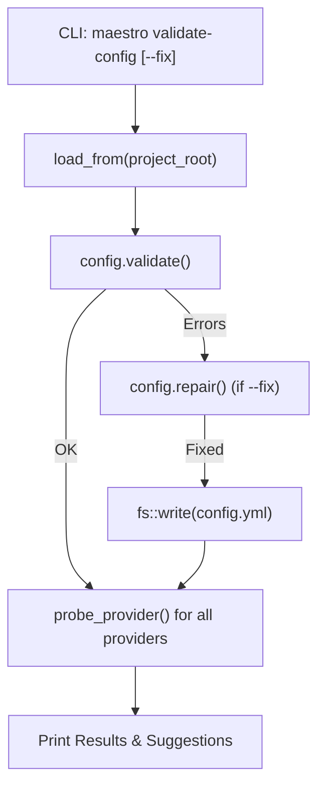

# Implementation Plan: `maestro validate-config` Improvements (Domain 1 — Item 1.3)

## Goal Description

**Feature Map Item 1.3** (`maestro validate-config`) currently performs offline cross-reference validation (checking if the default provider and models exist in the config file). Competitors like OpenCode and Aider offer rich inline suggestions, automatic fallback repairs, and active connection validations.

This plan upgrades `validate-config` so that Maestro can:

1. **Suggest fixes** in error messages for common typos or missing models.
2. **Provide a `--fix` flag** that attempts to automatically repair `maestro/config.yml` when obvious fallbacks exist (e.g., pointing a dangling default provider to the only declared provider).
3. **Validate remote provider availability** using the existing readiness probe so `validate-config` confirms that the configuration actually works in practice, not just structurally.

### Why This Matters (Competitive Gap)

| Capability | OpenCode | Aider | **Maestro Today** | **Maestro After** |
|---|---|---|---|---|
| Auto-validates structural cross-references | ✅ | ✅ | ✅ | ✅ |
| Inline suggestions for fixes | ✅ | ✅ | ❌ | ✅ |
| `--fix` auto-repair for common issues | ✅ | ❌ | ❌ | ✅ |
| Active remote availability check | ✅ | ❌ | ❌ | ✅ |

> [!IMPORTANT]
> **Model & Category Recommendation:** Gemini 3.5 Pro (High Category) / Claude Opus 4.6.
> Rationale: Implementing an auto-fixer that mutates configuration files requires careful state management, and extending the error type with rich suggestions touches domain definitions.

---

## User Review Required

> [!WARNING]
> **Remote validation is async.** The `validate-config` command will now use a Tokio one-shot runtime to probe the configured providers, meaning it requires network access and adds a slight delay (bounded by a 500ms timeout per provider).

> [!CAUTION]
> **The `--fix` flag rewrites `config.yml`.** It will rewrite the YAML using `serde_yaml`. This means formatting or comments in the original `config.yml` might be stripped or reformatted. We will emit a warning about this if `--fix` is executed.

---

## Architecture Overview



### Layer Mapping

| Layer | File | Change |
|---|---|---|
| **Presentation** | `src/presentation/cli/mod.rs` | Add `--fix` arg, handle async probing, display suggestions and probe results |
| **Domain** | `src/domain/models/config.rs` | Add `.suggestion()` to `ConfigError`, add `.repair()` logic to `MaestroConfig` |
| **Infrastructure** | `src/infrastructure/config.rs` | Expose `save_to` to allow the `--fix` flag to rewrite the file |

---

## Proposed Changes

### Domain — `ConfigError` Suggestions & Auto-Repair

#### [MODIFY] src/domain/models/config.rs

Add a `.suggestion()` method to `ConfigError`:

```rust
impl ConfigError {
    /// Returns a human-readable suggestion to fix the error.
    pub fn suggestion(&self) -> String {
        match self {
            Self::UnknownDefaultProvider(p) => {
                format!("Check your spelling. Did you declare '{}' under the `providers:` block?", p)
            }
            Self::UnknownDefaultModel { provider, model } => {
                format!("Provider '{}' does not have a model named '{}'. Try adding it to the `models:` list for that provider.", provider, model)
            }
            Self::UnknownAgentProvider { agent, provider } => {
                format!("Agent '{}' pins an unknown provider '{}'. Update its binding.", agent, provider)
            }
            Self::UnknownAgentModel { agent, provider, model } => {
                format!("Agent '{}' pins unknown model '{}' on provider '{}'.", agent, model, provider)
            }
        }
    }
}
```

Add a `.repair()` method to `MaestroConfig` that attempts to safely resolve errors:

```rust
impl MaestroConfig {
    /// Attempts to safely repair common structural errors.
    /// Returns true if changes were made.
    pub fn repair(&mut self) -> bool {
        let mut modified = false;

        // Repair dangling default provider
        if !self.providers.contains_key(&self.system.default_provider) {
            if self.providers.len() == 1 {
                let only_provider = self.providers.keys().next().unwrap().clone();
                self.system.default_provider = only_provider;
                modified = true;
            }
        }

        // Repair dangling default model
        if let Some(provider) = self.providers.get(&self.system.default_provider) {
            if !model_exists(provider, &self.system.default_model) {
                if provider.models.len() == 1 {
                    self.system.default_model = provider.models[0].name.clone();
                    modified = true;
                }
            }
        }

        // Drop invalid agent bindings
        let invalid_agents: Vec<String> = self.agents.iter()
            .filter(|(_, binding)| {
                let provider_ok = self.providers.contains_key(&binding.provider);
                let model_ok = self.providers.get(&binding.provider)
                    .map(|p| model_exists(p, &binding.model))
                    .unwrap_or(false);
                !provider_ok || !model_ok
            })
            .map(|(k, _)| k.clone())
            .collect();
            
        for agent in invalid_agents {
            self.agents.remove(&agent);
            modified = true;
        }

        modified
    }
}
```

---

### Infrastructure — Config Saving

#### [MODIFY] src/infrastructure/config.rs

Add a `save_to` function to serialize the fixed config back to disk.

```rust
/// Save a configuration to the given project root's maestro/config.yml.
pub fn save_to(project_root: &Path, config: &MaestroConfig) -> Result<(), ConfigLoadError> {
    let path = project_root.join("maestro/config.yml");
    let text = serde_yaml::to_string(config).map_err(|source| ConfigLoadError::Parse {
        path: path.display().to_string(),
        source,
    })?;
    std::fs::write(&path, text).map_err(|source| ConfigLoadError::Io {
        path: path.display().to_string(),
        source,
    })?;
    Ok(())
}
```

---

### Presentation — CLI Orchestration

#### [MODIFY] src/presentation/cli/mod.rs

Update the CLI struct:

```diff
-    /// Validate `maestro/config.yml` and its cross-references.
-    ValidateConfig,
+    /// Validate `maestro/config.yml` structural integrity and remote provider connectivity.
+    ValidateConfig {
+        /// Attempt to automatically repair structural errors.
+        #[arg(long)]
+        fix: bool,
+    },
```

Update `validate_config` logic:

```rust
fn validate_config(root: &Path, fix: bool) -> anyhow::Result<()> {
    // 1. Load config (without strict validation yet to allow repair)
    let text = std::fs::read_to_string(root.join("maestro/config.yml"))?;
    let mut config: crate::domain::models::config::MaestroConfig = serde_yaml::from_str(&text)?;
    
    // 2. Validate structural integrity
    if let Err(e) = config.validate() {
        if fix {
            print_line(&format!("structural error: {e}"));
            print_line("attempting --fix...");
            if config.repair() && config.validate().is_ok() {
                crate::infrastructure::config::save_to(root, &config)?;
                print_line("repair successful. config.yml rewritten.");
            } else {
                anyhow::bail!("could not auto-repair. Suggestion: {}", e.suggestion());
            }
        } else {
            print_line(&format!("Suggestion: {}", e.suggestion()));
            anyhow::bail!(e);
        }
    }
    
    print_line("structural validation: OK");

    // 3. Validate remote connectivity via Tokio one-shot runtime
    let registry = crate::infrastructure::llm::registry::ProviderRegistry::from_config(&config)?;
    let rt = tokio::runtime::Runtime::new()?;
    
    for (key, provider_config) in &config.providers {
        let provider = registry.resolve(key);
        let status = rt.block_on(crate::application::readiness::probe_provider(provider));
        print_line(&format!(
            "provider '{}' ({}): {:?}",
            key, provider_config.endpoint, status
        ));
    }
    
    Ok(())
}
```

---

### Task Specification

#### [NEW] 062-validate-config-improvements.md

A new task spec will be created at `docs/Maestro_Execution_Plans/tasks/062-validate-config-improvements.md` with acceptance criteria mapped to this plan.

---

### FEATURE_MAP Update

#### [MODIFY] FEATURE_MAP.md (Domain 1, item 1.3)

After implementation, the entry will be updated:

```diff
 ### 1.3 `maestro validate-config` — Config Validation
 
-- **Status:** ✅ Implemented
+- **Status:** ✅ Implemented (enhanced)
 - **Source:** `src/presentation/cli/mod.rs`, `src/infrastructure/config.rs`
-- **Business Value:** 🟢 Low
+- **Business Value:** 🟡 Medium
 - **What It Does Today:** Parses + validates `config.yml` with cross-reference checking
-  (providers/models/agents). Reports typed errors.
+- **What It Should Do:** `--fix` flag for auto-repair of common issues. Suggest fixes in error
-  messages. Validate against remote provider availability.
-- **Gap:** No auto-fix, no fix suggestions.
+-  (providers/models/agents). Reports typed errors with inline suggestions. Runs active network 
+-  probes against configured endpoints. Supports `--fix` for auto-repairing dangling defaults.
+- **What It Should Do:** Offer interactive CLI prompts for repairing complex errors instead of just `--fix` or dropping them.
+- **Gap:** No interactive repair wizard.
 - **Competitor Benchmark:**
   - *OpenCode*: Auto-validates on startup with inline error messages
   - *Aider*: Model validation with fallback suggestions
+    **Maestro now matches OpenCode and Aider with inline suggestions, plus adds auto-fix and active probing.**
```

---

## Acceptance Criteria

| ID | Criterion | Verified By |
|----|-----------|-------------|
| AC1 | Broken config fails validation and prints a helpful `.suggestion()` | Unit test |
| AC2 | `maestro validate-config --fix` repairs a dangling default provider if only 1 provider exists | Unit test |
| AC3 | `maestro validate-config --fix` repairs a dangling default model if the provider has only 1 model | Unit test |
| AC4 | `maestro validate-config --fix` drops invalid agent bindings | Unit test |
| AC5 | Rewritten config from `--fix` passes validation on the next run | Unit test |
| AC6 | Command outputs the active network probe status for all configured providers | Manual test |
| AC7 | All quality gates pass: `cargo fmt`, `cargo clippy`, `cargo test` | CI |

---

## Verification Plan

### Automated Tests

```bash
# 1. Formatting
cargo fmt --all --check

# 2. Lint
cargo clippy --all-targets -- -D warnings

# 3. All tests (including new validation tests)
cargo test --all-targets

# 4. Focused tests
cargo test -p maestro domain::models::config::tests -- --nocapture
```

### Manual Verification

1. **Test Auto-Fix:**
   Manually create a broken config in a tmp dir (e.g. `default_provider: wrong`).
   Run `cargo run -- validate-config --fix`.
   Confirm it fixes it.

2. **Test Active Probes:**
   Run `cargo run -- validate-config`.
   Confirm it prints the probe status (Available, Unreachable, etc.) for each provider.

---

## Risks & Rollback

| Risk | Mitigation |
|------|------------|
| Serde YAML strips comments | Known limitation of auto-fix rewrites; users will be warned. |
| Network probe latency | Probes run in sequence. Handled by small 500ms timeout per provider. |

**Rollback:** Revert changes to `src/domain/models/config.rs` and `mod.rs`. Remove the `062` task plan. No external systems affected.
